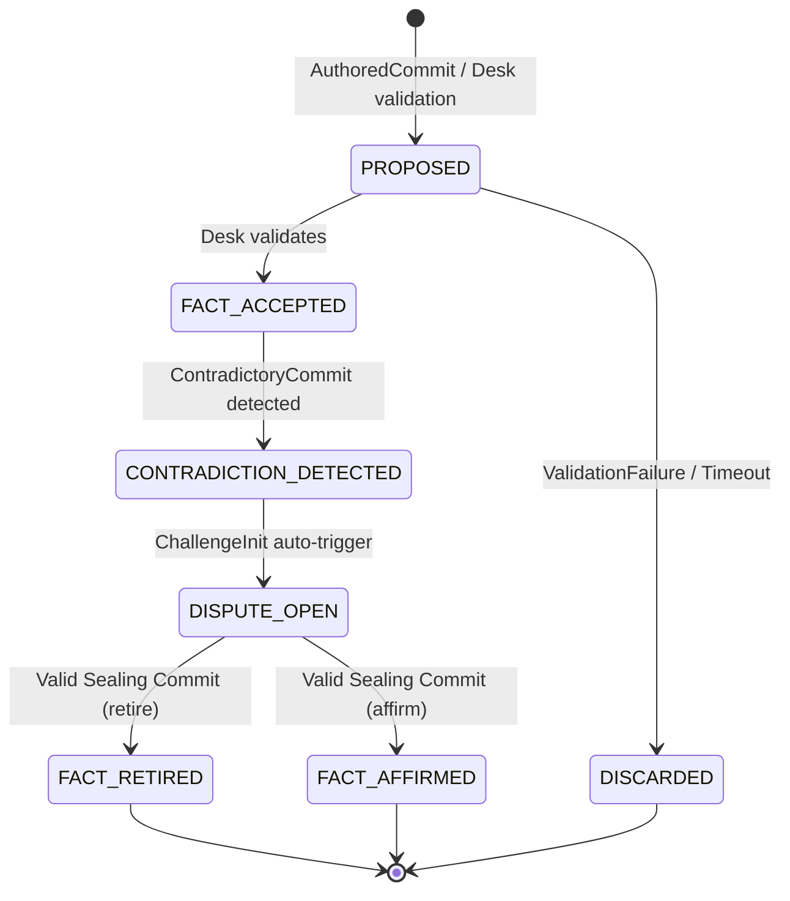

# Epistemic Machine Protocol (EMP)

> A Sovereign, Verifiable Substrate for Distributed Cognitive Integrity

The **Epistemic Machine Protocol (EMP)** is a *cryptographically verifiable, partition-tolerant substrate* for managing **cognitive state** in decentralized, multi-stakeholder systems. EMP is designed to survive disagreement without erasing it, and resolve conflict without centralizing power. It provides a **notarized transition algebra** that replaces discretion with verifiable procedure.

---

## 1. Introduction

> *Truth is not discovered by machines. It is witnessed, negotiated, and held by communities. EMP provides infrastructure for that work — no more, no less.*

EMP diverges from traditional systems:

| Approach                   | EMP Relation                  |
| -------------------------- | ----------------------------- |
| Distributed state machines | Adds **epistemic semantics**  |
| Byzantine quorum systems   | Adds **social roles**         |
| CRDTs                      | Retains **semantic conflict** |
| Blockchains                | Rejects **global consensus**  |

**Design Ethos:**

* Truth may *pause*.
* Contradiction may *spread*.
* Finality cannot be *forged*.

EMP enforces **epistemic safety** by forbidding progress without notarized authority and ensures **liveness** by allowing contradiction and challenge to propagate.

### 1.1 Cognitive Split-Brain Problem

A **Cognitive Split-Brain** occurs when multiple agents hold mutually incompatible beliefs, each with plausible provenance, and no shared mechanism exists to resolve conflict. Traditional systems attempt to hide disagreement, centralize authority, or rely on external resolution — all of which fail under scale, pluralism, or contestation. EMP treats disagreement as a **first-class state**.

### 1.2 Not a Truth Machine

EMP **does not** discover truth, optimize beliefs, or rank correctness. It explicitly rejects:

* Universal ontologies
* Objective global truth
* Machine-final epistemic authority
* Implicit scientific primacy

Instead, EMP provides:

* **Witnessing:** who asserted what
* **Process:** how claims were challenged
* **Resolution:** how disputes ended
* **Memory:** what was held true at a time

Truth remains **socially held**.

### 1.3 Git-Like DAG over CRDTs

CRDTs discard semantic conflict to converge. EMP preserves conflict using a **Git-like DAG**:

* Explicit ancestry
* Immutable history
* Branch-based disagreement
* Cryptographic identity

The DAG records *what happened*; the EFSM governs *what is allowed*.

### 1.4 EFSM Governance

EMP uses a deterministic **Extended Finite State Machine (EFSM)** to enumerate valid states and transitions. Invalid moves are **unrepresentable**, converting governance from discretion into **verifiable procedure**.

### 1.5 Desks and Determinism

Desks are **polycentric, deterministic notaries**:

* Auditable, replayable, and replaceable
* Two Desks with same inputs reach same decisions
* Governance disputes can be re-evaluated
* Desk is *procedural*, not sovereign

### 1.6 Sealing Commits

Sealing commits provide **cryptographic finality**:

* Freeze disputes (`DISPUTE_OPEN`)
* Transition to `FACT_RETIRED` or `FACT_AFFIRMED`
* Preserve full audit trail; nothing is erased

### 1.7 Prompt De-Powering

* Prompts configure reasoning, **never assert truth**
* Hash-only references
* Draft outputs require human ratification

### 1.8 Sovereignty as a Technical Constraint

* Offline-first operation
* Replaceable components
* Paper-compatible workflows
* Must be runnable without cloud access

---

## 2. Architecture Overview

### 2.1 Abstractions

| Term          | Definition                                  | Technical Realization                    |
| ------------- | ------------------------------------------- | ---------------------------------------- |
| Fact          | A belief asserted by a human                | `Commit` (CUE schema)                    |
| Ref           | Mutable pointer to commit history           | e.g., `refs/epistemic/@community/...`    |
| Desk          | Local notary service                        | SQL-RBAC backend                         |
| Seal          | Cryptographic commitment resolving disputes | `SealingCommit` w/ quorum signatures     |
| Epistemic Ref | Authoritative community history             | Append-only DAG, frozen on contradiction |

### 2.2 Layered Architecture

```
┌───────────────────────────┐
│ Executive Layer           │
│ Enacts decisions          │
└───────────────────────────┘
          ▲
┌───────────────────────────┐
│ Teleological Layer        │
│ Defines norms & objectives│
└───────────────────────────┘
          ▲
┌───────────────────────────┐
│ Deliberative Layer        │
│ Configures reasoning      │
└───────────────────────────┘
          ▲
┌───────────────────────────┐
│ Epistemic Layer           │
│ Records held truths       │
└───────────────────────────┘
```

Layers communicate via **signed, hash-pinned messages**, not shared databases.

### 2.3 Agent Taxonomy

| Role             | Authority     | Commit  | Identity          | Constraint                                              |
| ---------------- | ------------- | ------- | ----------------- | ------------------------------------------------------- |
| Knowledge Keeper | Authoritative | Author  | Human             | Only role allowed to AUTHOR epistemic facts             |
| Notary (Desk)    | Advisory      | Commit  | Human collective  | Must not appear in `author`; may issue `SealingCommits` |
| Interpreter      | Advisory      | Propose | Human/AI          | May propose teleological updates                        |
| Observer         | —             | Observe | Any               | Must not emit commits                                   |
| Sensor/Probe     | Synthetic     | Propose | Device/Simulation | Draft only, must include calibration metadata           |

---

## 3. EFSM: Epistemic State Machine



**States:** `PROPOSED`, `FACT_ACCEPTED`, `CONTRADICTION_DETECTED`, `DISPUTE_OPEN`, `FACT_RETIRED`, `FACT_AFFIRMED`, `DISCARDED`
**Inputs:** `AuthoredCommit`, `ValidationFailure`, `ContradictoryCommit`, `ChallengeInit`, `ValidSealingCommit`
**Final States:** `FACT_RETIRED`, `FACT_AFFIRMED`, `DISCARDED`

**Transition Table**:

| From                   | Input                       | To                     | Guard                              |
| ---------------------- | --------------------------- | ---------------------- | ---------------------------------- |
| PROPOSED               | AuthoredCommit              | FACT_ACCEPTED          | Desk validation ∧ Knowledge Keeper |
| PROPOSED               | ValidationFailure / Timeout | DISCARDED              | `timer > T_max`                    |
| FACT_ACCEPTED          | ContradictoryCommit         | CONTRADICTION_DETECTED | Semantic conflict                  |
| CONTRADICTION_DETECTED | ChallengeInit               | DISPUTE_OPEN           | Auto-triggered, ref frozen         |
| DISPUTE_OPEN           | ValidSealingCommit(retire)  | FACT_RETIRED           | Quorum ≥ ⌈N/2⌉+1 + FINALITY signer |
| DISPUTE_OPEN           | ValidSealingCommit(affirm)  | FACT_AFFIRMED          | Same as above                      |

**Formal Invariants**:

```text
∀ c ∈ Commits: c.state ∈ S
state(c) ∈ F ⇒ terminal(c)
contradiction(c1, c2) ⇒ ∃ DISPUTE_OPEN(c1 ∨ c2)
```

---

## 4. Gossip Protocol & Partition Semantics

**Message Structure (ABNF)**:

```abnf
gossip-packet       = signed-envelope
signed-envelope     = payload ref-hint connectivity-status dispute-vector signature
```

**Network Invariants**:

* Monotonicity: no deletion of commits
* Epistemic Freeze: cannot advance refs without Desk
* Challenge Fluidity: propagate challenges always
* Conflict Propagation: contradictions freeze refs and propagate

**Partition Recovery**:

1. Quarantine `PROPOSED` commits
2. Track `CONTRADICTION_DETECTED`
3. Do not advance refs
4. On reconnection: authenticate → Desk → deterministic revalidation → retry up to `T_retry_max`

---

## 5. Prompts & PSL

* Hash-only references, no authority
* Draft outputs → FCHA ratification

```yaml
apiVersion: emp.ps/v1
kind: PromptSpec
meta:
  agent: { principalID: "interp-01", role: "Interpreter" }
spec:
  template: "Compare climate accounts from multiple traditions."
  inputs:
    - type: epistemic
      hash: "sha3-512:a1b2..."
  output:
    targetRef: refs/epistemic/@community/drafts/climate-comparison
    reviewerRoles: ["knowledge-keeper"]
```

---

## 6. Sealing Commits & Cryptographic Finality

* Resolve `DISPUTE_OPEN` → `FACT_RETIRED` / `FACT_AFFIRMED`
* Threshold ≥ ⌈N/2⌉+1 + ≥1 FINALITY signer
* Canonical serialization + SHA-512
* Idempotent

---

## 7. Desk: SQL-RBAC Notary

* Local, auditable, deterministic
* Guard evaluation: `(P, R, C)` valid iff `P` has rights, DAG consistent, Desk active, ref not frozen
* SQL Schema provided (PostgreSQL-compatible)

---

## 8. Implementation Contract

```python
class EmpImplementation:
    def get_commit_state(self, commit_hash: str) -> str: ...
    def apply_transition(...): ...
    def get_seal_for(...): ...
    def detect_contradiction(...): ...
    def verify_sealing_commit(...): ...
```

---

## 9. Deployment & Temporal Bounds

| Context      | Stack                                 |
| ------------ | ------------------------------------- |
| Rural        | SQLite Desk + JSON + USB              |
| Indigenous   | Paper + QR hashes + council Desk      |
| National     | PostgreSQL Desk + IPFS + federated ID |
| Global South | Offline P2P + local Desk              |

| Parameter    | Example |
| ------------ | ------- |
| T_max        | 10s     |
| T_revalidate | 30s     |
| T_retry_max  | 5 min   |
| T_review_max | 24h     |

---

## 10. Formal Semantics & Inference Rules

See [Architecture Design](./docs/architecture/design/README.md) for detailed EFSM definitions and inference rules: 

- ASCII math EFSM definitions
- Commit state invariants
- Contradiction & dispute rules
- Sealing commit preconditions and transitions
- Determinism and idempotence rules
- Safety theorems: No Silent Forks, No Unauthorized Truth, Finality

## References

1. **Distributed Systems**:
   - Lamport, L. (1978). "Time, Clocks, and the Ordering of Events in a Distributed System"
   - Fischer, M. et al. (1985). "Impossibility of Distributed Consensus with One Faulty Process"

2. **Byzantine Fault Tolerance**:
   - Castro, M. & Liskov, B. (1999). "Practical Byzantine Fault Tolerance"
   - Distler, T. et al. (2011). "Resource-Efficient Byzantine Fault Tolerance"

3. **CRDTs**:
   - Shapiro, M. et al. (2011). "Conflict-free Replicated Data Types"
   - Kleppmann, M. & Beresford, A. (2017). "A Conflict-Free Replicated JSON Datatype"

4. **Hybrid Logical Clocks**:
   - Kulkarni, S. et al. (2014). "Logical Physical Clocks and Consistent Snapshots in Globally Distributed Databases"

5. **Epistemic Logic**:
   - Halpern, J. & Moses, Y. (1990). "Knowledge and Common Knowledge in a Distributed Environment"

6. **Indigenous Knowledge Systems**:
   - Smith, L. T. (2012). "Decolonizing Methodologies: Research and Indigenous Peoples"
   - Whyte, K. (2018). "Indigenous Science (Fiction) for the Anthropocene"
