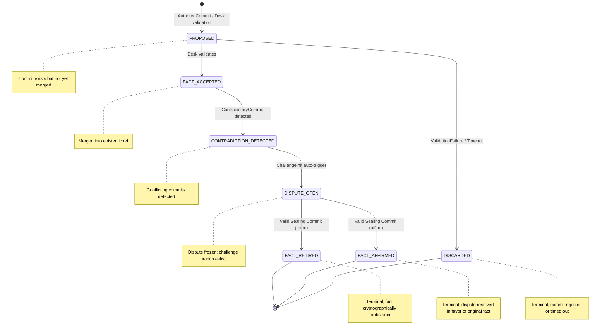

# Epistemic Machine Protocol (EMP)

> Secure, Verifiable, Decentralised Cognitive State Management Protocol

The EMP specifies a verifiable, partition-tolerant, cryptographically enforceable
state-transition substrate for decentralised cognitive systems.

---

## 1. Introduction

The EMP addresses the “Cognitive Split-Brain” problem by replacing autonomous agent
discretion with a notarised transition algebra. EMP defines:

- **Epistemic refs** as authoritative histories
- **First-Class Human Agents** as committers of facts
- **Meta-Agents** for teleological / policy operations
- **Desk (SQL-RBAC)** as deterministic notary
- **Sealing Commits** as cryptographic finality



---

## 2. Terminology & Object Model

| Term | Definition |
|------|------------|
| Fact | Git commit object asserted by a First-Class Human Agent |
| Ref | Mutable pointer categorised by `trust_level` (e.g., `refs/heads/main`) |
| Desk | Distinguished Notary Principal backed by SQL-RBAC quorum |
| Seal | Cryptographic commit that hardens a belief to finality |
| Sealing Commit | Specialised commit authored by Desk moving a commit from `DISPUTE_OPEN` → `FACT_RETIRED` / `FACT_AFFIRMED` |

---

## 3. Extended Finite State Machine (EFSM)

### 3.1 EFSM Definition

```text
S = { PROPOSED,
      FACT_ACCEPTED,
      CONTRADICTION_DETECTED,
      DISPUTE_OPEN,
      FACT_RETIRED,
      FACT_AFFIRMED,
      DISCARDED }

I = { AuthoredCommit,
      ValidationFailure,
      ContradictoryCommit,
      ChallengeInit,
      ValidSealingCommit }

F = { FACT_RETIRED, FACT_AFFIRMED, DISCARDED }

T ⊆ S × I × S × G
G = guard conditions
````

Initial state: `PROPOSED`

EFSM tuple:

```text
EFSM = (S, I, T, PROPOSED, F)
```

### 3.2 Transition Relation

| Current State          | Input                       | Target State           | Guard / Condition              |
| ---------------------- | --------------------------- | ---------------------- | ------------------------------ |
| PROPOSED               | AuthoredCommit              | FACT_ACCEPTED          | Desk validation active         |
| PROPOSED               | ValidationFailure / Timeout | DISCARDED              | Desk reject or timer > `T_max` |
| FACT_ACCEPTED          | ContradictoryCommit         | CONTRADICTION_DETECTED | Semantic conflict detected     |
| CONTRADICTION_DETECTED | ChallengeInit               | DISPUTE_OPEN           | Auto-trigger mandatory         |
| DISPUTE_OPEN           | ValidSealingCommit(retire)  | FACT_RETIRED           | Section 7 verification         |
| DISPUTE_OPEN           | ValidSealingCommit(affirm)  | FACT_AFFIRMED          | Section 7 verification         |

#### 3.3 Formal Invariants

```text
∀ c ∈ Commits:
    c.state ∈ S

∀ c:
    c.state ∈ F ⇒ is_terminal(c)

∀ c1, c2:
    CONTRADICTION_DETECTED(c1, c2)
    ⇒ ∃ DISPUTE_OPEN(c1 or c2)

Any transition not in T MUST be rejected
```

---

## 4. Gossip Protocol & Partition Semantics

### 4.1 Message Structure (ABNF)

```abnf
gossip-packet       = signed-envelope
signed-envelope     = payload ref-hint connectivity-status dispute-vector signature
payload             = git-commit / git-bundle
ref-hint            = "epistemic" / "teleological"
connectivity-status = "online" / "offline" / advisory
dispute-vector      = 1*(commit-hash)
signature           = base64
```

### 4.2 Invariants

* **G-INV-0 (Monotonicity):**
  Nodes must not delete or hide received commits or dispute vectors
* **G-INV-1 (Epistemic Freeze):**
  Nodes must not advance epistemic refs without an active Desk session
* **G-INV-2 (Challenge Fluidity):**
  Challenge branches propagate regardless of connectivity
* **G-INV-3 (Conflict Propagation):**
  Contradictions freeze refs and propagate challenge immediately

### 4.3 Partition Recovery Protocol

1. Accept gossip only; accumulate `PROPOSED` commits in quarantine
2. Track `CONTRADICTION_DETECTED` locally
3. Do not advance epistemic refs during partition
4. On reconnection:

   * Authenticate node → Desk
   * Exchange partition marker: `HEAD`, challenges, nonce
   * Desk responds with authoritative `HEAD`, sealing commits, signed nonce
   * Node applies deterministic revalidation loop
   * Retry up to `T_retry_max` if Desk unreachable

---

## 5. Desk / SQL-RBAC Interface

### 5.1 Guard Evaluation

Transition `(P, R, C)` is valid if:

1. Principal `P` has rights for ref `R`
2. Commit `C` is consistent with DAG
3. Desk connection is active

**Determinism**

* Desk returns signed `ACCEPT` or `REJECT`
* Responses are idempotent
* Reject if `R` is in `DISPUTE_OPEN`

---

## 6. Sealing Commits (Steel Roof)

### 6.1 Definition

* Moves `DISPUTE_OPEN` → `FACT_RETIRED` or `FACT_AFFIRMED`
* Must be a direct child of the disputed commit

### 6.2 Manifest (ABNF)

```abnf
sealing-trailers =
  "Epistemic-Seal-Version:" version CRLF
  "Seals-Target-Commit:" commit-hash CRLF
  "Resolution-Type:" ("RETIRE" / "REAFFIRM" / "AMEND") CRLF
  "RBAC-Transaction-ID:" uuid CRLF
  "Quorum-Signatures:" json-array CRLF
```

### 6.3 Quorum Semantics

* Threshold: `ceil(N/2) + 1`
* ≥1 signer with `FINALITY` permission
* Signers must be active at transaction timestamp
* Reject duplicate signatures

### 6.4 Verification

* Canonical serialization (exclude quorum signatures)
* SHA-512 hash verification
* Seal valid if threshold and authority rules satisfied
* Application is idempotent

---

## 7. Formal Semantics & Machine Readability

### 7.1 ABNF Grammar (Sealing Commit)

```abnf
sealing-commit     = git-commit-header sealing-trailers sealing-content
git-commit-header =
  "tree " HEXDIG{40} CRLF
  "parent " HEXDIG{40} CRLF
  "author " author-ident CRLF
  "committer " committer-ident CRLF CRLF

sealing-content =
  *(UTF8-NONASCII / %x20-7E)
```

### 7.2 EMP Implementation Contract

```python
class EmpImplementation:
    def get_commit_state(self, commit_hash: str) -> str: ...
    def apply_transition(
        self,
        commit_hash: str,
        target_state: str,
        reason: str | None = None,
        seal: GitCommit | None = None
    ) -> bool: ...
    def get_seal_for(self, commit_hash: str) -> GitCommit | None: ...
    def detect_contradiction(self, commit1: str, commit2: str) -> bool: ...
    def verify_sealing_commit(self, seal: GitCommit) -> VerificationResult: ...
```

---

## 8. Security Considerations

* Byzantine humans mitigated via N-of-M quorum
* Partition recovery ensures deterministic reconciliation
* Steel Roof invariants prevent connectivity spoofing, zombie disputes, and semantic forks
* Historical seals remain auditable under RBAC changes

---

## 9. References

* Git object model and commit DAG
* CRDTs and eventual consistency
* Byzantine quorum systems
* Distributed state machine theory

---

## 10. Appendix

### 10.1 Pseudocode for Transition Verification

```python
def apply_transition(commit_hash: str, target_state: str, seal: Optional[GitCommit] = None) -> bool:
    """
    Verify and apply a transition in the EMP EFSM.
    """
    current_state = get_commit_state(commit_hash)

    # Check if transition is valid
    if (current_state, target_state) not in allowed_transitions():
        return False  # EFSM-1 invariant: reject invalid transitions

    # Desk validation if required
    if requires_desk_validation(target_state):
        if not desk_connection_active():
            return False
        if not desk_validate_transition(commit_hash, target_state):
            return False

    # Verify sealing commit if present
    if seal is not None:
        result = verify_sealing_commit(seal)
        if not result.valid:
            return False

    # Apply transition
    set_commit_state(commit_hash, target_state)
    return True
````

---

## 10.2 Sample Gossip Message (JSON)

```json
{
  "payload": {
    "commit_hash": "abcd1234...",
    "author": "Alice",
    "message": "Add new epistemic fact"
  },
  "ref_hint": "epistemic",
  "connectivity_status": "online",
  "dispute_vector": [],
  "signature": "BASE64_SIGNATURE_HERE"
}
```

---

### 10.3 Sample Sealing Commit (Git commit message)

```text
tree e3f1a2...
parent ab12cd...
author Desk <desk@example.com>
committer Desk <desk@example.com>

Epistemic-Seal-Version: v1
Seals-Target-Commit: abcd1234...
Resolution-Type: RETIRE
RBAC-Transaction-ID: 123e4567-e89b-12d3-a456-426614174000
Quorum-Signatures: [
    {
        "algorithm": "ed25519",
        "principal": "Alice",
        "signature": "BASE64_SIG",
        "timestamp": "2025-12-16T21:30:00Z",
        "nonce": "550e8400-e29b-41d4-a716-446655440000"
    },
    {
        "algorithm": "ed25519",
        "principal": "Bob",
        "signature": "BASE64_SIG",
        "timestamp": "2025-12-16T21:30:05Z",
        "nonce": "550e8400-e29b-41d4-a716-446655440001"
    }
]
```

---

### 10.4 Temporal Bounds Definitions

| Parameter      | Description                                                                            | Example Value |
| -------------- | -------------------------------------------------------------------------------------- | ------------- |
| `T_max`        | Maximum time to validate a proposed commit                                             | 10s           |
| `T_revalidate` | Maximum time to wait for Desk during partition recovery before pausing ref advancement | 30s           |
| `T_retry_max`  | Maximum total retry time for partition reconciliation                                  | 5 min         |

```
