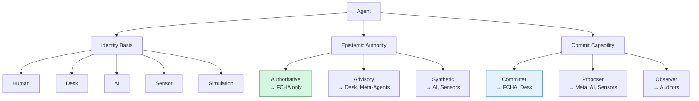

# EMP Agent Taxonomy

> **First-Class Human Agent (FCHA):** *A human principal with `epistemicAuthority = Authoritative`, the only agent permitted to author factual commits. All other agents are epistemically advisory or synthetic.*

We define agents by **four orthogonal axes**:

| Axis                       | Values                                        | Purpose                                 |
| -------------------------- | --------------------------------------------- | --------------------------------------- |
| **1. Epistemic Authority** | `Authoritative`, `Advisory`, `Synthetic`      | Can *originate* facts? Or only suggest? |
| **2. Commit Capability**   | `Committer`, `Proposer`, `Observer`           | Can write to refs? Propose? Read-only?  |
| **3. Identity Basis**      | `Human`, `Desk`, `AI`, `Sensor`, `Simulation` | What *kind* of principal is this?       |
| **4. Temporal Scope**      | `Ephemeral`, `Session`, `Persistent`          | How long does its authority last?       |

These axes combine to yield **precise, composable agent roles**—each with normative EMP behavior.



*(Green = FCHA-only privileges)*

---

## 1. Taxonomy Matrix (Normative)

| Role                               | Epistemic Authority | Commit Capability | Identity Basis      | Temporal Scope | EMP Layer                | RFC 2119 Constraint                                                                                                                                                        |
| ---------------------------------- | ------------------- | ----------------- | ------------------- | -------------- | ------------------------ | -------------------------------------------------------------------------------------------------------------------------------------------------------------------------- |
| **First-Class Human Agent (FCHA)** | `Authoritative`     | `Committer`       | `Human`             | `Persistent`   | Epistemic                | **MUST** be the *only* agent allowed to `AUTHOR` a `Fact` commit (`author.type = "Human"`). Desk may `COMMIT`, but never `AUTHOR`.                                         |
| **Desk Principal**                 | `Advisory`          | `Committer`       | `Desk`              | `Persistent`   | Epistemic / Executive    | **MAY** `COMMIT` sealing/retirement commits. **MUST NOT** appear in `author` field. **MUST** sign with institutional key.                                                  |
| **Meta-Agent**                     | `Advisory`          | `Proposer`        | `AI` | `Human`      | `Session`      | Teleological             | **MAY** propose *teleological* commits (policy updates). **MUST** be ratified by ≥1 FCHA to become `FACT_ACCEPTED`.                                                        |
| **Synthetic Proposer**             | `Synthetic`         | `Proposer`        | `AI` | `Simulation` | `Ephemeral`    | Deliberative             | **MAY** propose commits **ONLY** with `trustLevel: "draft"` and `source-type: "ai"` trailer. **MUST** be reviewed by FCHA within `T_review_max` (24h) or auto-`DISCARDED`. |
| **Sensor Agent**                   | `Synthetic`         | `Proposer`        | `Sensor`            | `Ephemeral`    | Epistemic / Deliberative | **MAY** propose commits with `source-type: "sensor"` and calibrated metadata. **MUST** include `calibration-cert: URI`.                                                    |
| **Observer**                       | —                   | `Observer`        | Any                 | Any            | All Layers               | **MAY** subscribe to gossip, validate seals, audit history. **MUST NOT** emit commits.                                                                                     |

> ✅ **Key Innovation**: Authority is **separated from capability**.
>
> * An LLM can be a *Synthetic Proposer* (suggests), but never *Authoritative*.
> * A human can be a *Meta-Agent* (policy), but still requires Desk sealing for finality.

---

## 2. Layer Mapping & Temporal Enforcement

| Role               | EMP Layer                | Temporal Behavior                                                |
| ------------------ | ------------------------ | ---------------------------------------------------------------- |
| FCHA               | Epistemic                | Persistent → stored indefinitely in DAG/Desk                     |
| Desk               | Epistemic / Executive    | Persistent → authoritative seals and retirements                 |
| Meta-Agent         | Teleological             | Session → bound to runtime session; requires FCHA ratification   |
| Synthetic Proposer | Deliberative             | Ephemeral → auto-purged if review timeout exceeds `T_review_max` |
| Sensor             | Epistemic / Deliberative | Ephemeral → commits must include calibration certificate         |
| Observer           | All Layers               | Any → read-only auditing, no temporal enforcement needed         |

---

## 3. CUE Embedding (Machine-Enforceable)

Add to `schemas/agent.cue`:

```cue
package emp

// Axis 1: Epistemic Authority
EpistemicAuthority: "Authoritative" | "Advisory" | "Synthetic"

// Axis 2: Commit Capability
CommitCapability: "Committer" | "Proposer" | "Observer"

// Axis 3: Identity Basis
IdentityBasis: "Human" | "Desk" | "AI" | "Sensor" | "Simulation"

// Axis 4: Temporal Scope
TemporalScope: "Ephemeral" | "Session" | "Persistent"

// Agent Role — composition of axes
AgentRole: {
	name: string & >""

	// Constraints (normative — enforced at Desk validation)
	epistemicAuthority: EpistemicAuthority
	commitCapability:   CommitCapability
	identityBasis:      IdentityBasis
	temporalScope:      TemporalScope

	// Derived invariants
	(name == "First-Class Human Agent") => 
		epistemicAuthority == "Authoritative" &&
		commitCapability == "Committer" &&
		identityBasis == "Human" &&
		temporalScope == "Persistent" |

	(name == "Desk Principal") => 
		epistemicAuthority == "Advisory" &&
		commitCapability == "Committer" &&
		identityBasis == "Desk" |

	(identityBasis == "AI") => 
		epistemicAuthority == "Synthetic" &&
		commitCapability == "Proposer" &&
		temporalScope == "Ephemeral" |

	(commitCapability == "Observer") => 
		epistemicAuthority == _|_  // undefined — no authority
}

// Principal — runtime instance of a role
Principal: {
	id:             string & >""
	role:           string  // name of AgentRole
	publicKey:      string & >""
	email?:         string  // required if Human
	sourceType?:    "ai" | "sensor" | "simulation"  // required if Synthetic
	calibrationCert?: string  // required if Sensor
	sessionID?:     string  // required if Session/Ephemeral
	revokedAt?:     time.Time
}
```

> **Validation Example**:
> A `Synthetic Proposer` trying to commit a sealing transaction will fail **Desk RBAC**, preserving epistemic integrity.

---

## 4. RBAC Policy Integration (YAML + SQL)

Extend `PolicyRule` to scope by `agentRole`:

```yaml
- id: "ai-draft-proposal"
  refGlob: "refs/epistemic/drafts/*"
  verb: "propose"
  condition:
    requiredRoles: ["ai-proposer"]
    agentRole: "Synthetic Proposer"
    sourceType: "ai"

- id: "human-fact-committal"
  refGlob: "refs/epistemic/verified/*"
  verb: "propose"
  condition:
    requiredRoles: ["scientist"]
    agentRole: "First-Class Human Agent"
```

SQL enforcement:

```sql
ALTER TABLE principals 
  ADD COLUMN agent_role TEXT NOT NULL,
  ADD COLUMN source_type TEXT CHECK (source_type IN ('ai','sensor','simulation'));

-- Update rbac_authorize to check agent_role and source_type
AND (required_agent_role IS NULL OR agent_role = required_agent_role)
AND (required_source_type IS NULL OR source_type = required_source_type)
```

---

## 5. Threat Model Implications

| Agent           | Threat             | Mitigation                                               |
| --------------- | ------------------ | -------------------------------------------------------- |
| **FCHA**        | Malicious human    | Quorum sealing (≥2 FCHAs) + audit log                    |
| **AI Proposer** | Hallucinated draft | Auto-`DISCARDED` on `T_review_max`; `trustLevel: draft`  |
| **Desk**        | Compromised key    | Key rotation + epoch binding (`Desk-Epoch`)              |
| **Sensor**      | Calibration drift  | Require `calibration-cert`; Desk validates URI signature |

> 🔔 **Critical RFC Statement**:
> *EMP guarantees **traceability, contestability, and finality**, not truth. Epistemic authority resides solely in FCHAs, mediated by Desk.*

