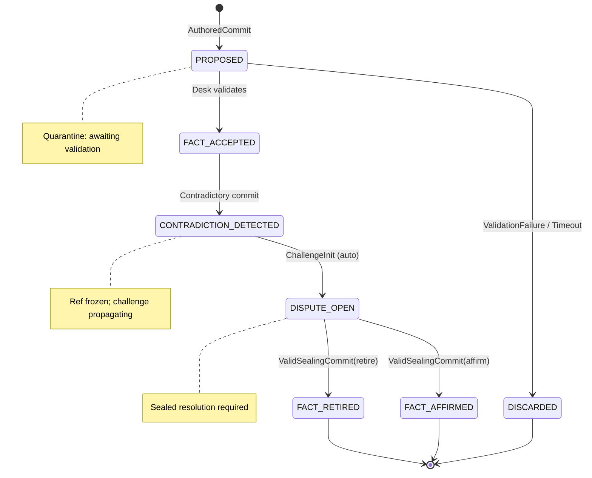

# Epistemic Machine Protocol (EMP)

> A Sovereign, Verifiable Substrate for Distributed Cognitive Integrity

The **Epistemic Machine Protocol (EMP)** is a *cryptographically verifiable, partition-tolerant substrate* for managing **cognitive state** in decentralised, multi-stakeholder systems.

EMP is designed to survive disagreement without erasing it — and resolve conflict without centralising power. It specifies a verifiable, partition-tolerant, cryptographically enforceable
state-transition substrate for decentralised cognitive systems. 

## Document Structure

**Part I**: Core Protocol (Sections 1-5)  
**Part II**: Network & Security (Sections 6-9)  
**Part III**: Implementation (Sections 10-11)  
**Part IV**: Formal Specifications (Appendices A-C)

---

# Part I: Core Protocol

## 1. Introduction

> *Truth is not discovered by machines. It is witnessed, negotiated, and held by communities. EMP provides infrastructure for that work—no more, no less.*

The **Epistemic Machine Protocol (EMP)** is a cryptographically verifiable, partition-tolerant substrate for managing **cognitive state** in decentralized, multi-stakeholder systems.

### 1.1 Design Ethos

**Truth** may *pause*. **Contradiction** may *spread*. **Finality** cannot be *forged*.

EMP enforces epistemic safety by forbidding progress without notarized authority, and ensures liveness by allowing contradiction and challenge to propagate even when truth cannot yet be finalized.

### 1.2 What EMP Is Not

EMP explicitly rejects:
- Universal ontologies
- Objective global truth
- Machine-final epistemic authority
- Implicit Western scientific primacy
- Global consensus requirements
- Cloud-dependent operation

These assumptions collapse in:
- Indigenous knowledge contexts
- Interdisciplinary science
- Politically contested domains
- Long-horizon archival systems

### 1.3 Relationship to Adjacent Work

EMP draws from but diverges from:

| System | EMP Adaptation |
|--------|----------------|
| Distributed state machines | Adds epistemic semantics |
| Byzantine quorum systems | Adds social roles + polycentric authority |
| CRDTs | Retains conflict as first-class state |
| Blockchains | Rejects global consensus |
| Git | Adds normative transition algebra |

### 1.4 Intended Adopters

- Indigenous knowledge collectives  
- Public research infrastructures  
- Decentralized cooperatives  
- Intergovernmental scientific bodies  
- Community archives  
- Human rights documentation projects

---

## 2. Architecture Overview

### 2.1 Core Abstractions

| Term | Definition | Technical Realization |
|------|------------|----------------------|
| **Fact** | A belief asserted by a human | Git commit with `author ∈ First-Class Human Agent` |
| **Ref** | Mutable pointer to commit history | e.g., `refs/epistemic/@community/climate/main` |
| **Desk** | Locally governed notary service | SQL-RBAC backend (PostgreSQL-compatible) |
| **Seal** | Cryptographic dispute resolution | `SealingCommit` with quorum signatures |
| **Epistemic Ref** | Authoritative history | Append-only DAG, frozen on contradiction |

### 2.2 Layered Architecture (Polycentric)

```
┌─────────────────────────────────────────────┐
│ Executive Layer: Enacts decisions           │
│ (e.g., policy rollout, resource allocation) │
└─────────────────────────────────────────────┘
                    ▲
                    │ signed action
┌─────────────────────────────────────────────┐
│ Teleological Layer: Defines norms           │
│ (e.g., "Reduce emissions by 2030")          │
│ → refs/teleological/@community/policy/v3    │
└─────────────────────────────────────────────┘
                    ▲
                    │ hash-pinned proposals
┌─────────────────────────────────────────────┐
│ Deliberative Layer: Configures reasoning    │
│ (e.g., prompts, tools, cross-knowledge)     │
│ → PromptSpec (YAML/CUE), hash-only binding  │
└─────────────────────────────────────────────┘
                    ▲
                    │ ratified proposals
┌─────────────────────────────────────────────┐
│ Epistemic Layer: Records held truth         │
│ (e.g., "CO₂ > 420ppm in 2025—NOAA, sealed") │
│ → refs/epistemic/@community/climate/verified│
└─────────────────────────────────────────────┘
```

**Interoperability**: Layers communicate via signed, hash-pinned messages. No shared database required.

### 2.3 Agent Taxonomy

Agents are **social roles** mapped to technical capabilities. Roles are contextual, consensual, and non-hierarchical.

| Role | Epistemic Authority | Commit Capability | Identity Basis | Temporal Scope |
|------|---------------------|-------------------|----------------|----------------|
| **Knowledge Keeper** | Authoritative | Committer | Human | Persistent |
| **Notary (Desk)** | Advisory | Committer | Human collective | Persistent |
| **Interpreter** | Advisory | Proposer | Human/AI/Tool | Session |
| **Observer** | — | Observer | Any | Any |
| **Sensor/Probe** | Synthetic | Proposer | Device/Simulation | Ephemeral |

**Sovereignty Note**: A Knowledge Keeper in one community may be an Observer in another. Roles are defined by local consensus, not global registry.

---

## 3. State Machine: Epistemic EFSM

All epistemic commits follow a deterministic, verifiable transition algebra.

### 3.1 EFSM Definition

```text
States S = {
  PROPOSED,
  FACT_ACCEPTED,
  CONTRADICTION_DETECTED,
  DISPUTE_OPEN,
  FACT_RETIRED,
  FACT_AFFIRMED,
  DISCARDED
}

Inputs I = {
  AuthoredCommit,
  ValidationFailure,
  ContradictoryCommit,
  ChallengeInit,
  ValidSealingCommit
}

Final States F = {
  FACT_RETIRED, FACT_AFFIRMED, DISCARDED
}

Initial state: PROPOSED
EFSM = (S, I, T, PROPOSED, F)
```

### 3.2 State Transition Diagram



### 3.3 Transition Table (Normative)

| From | Input | To | Guard Condition |
|------|-------|----|-----------------|
| `PROPOSED` | `AuthoredCommit` | `FACT_ACCEPTED` | Desk validation active ∧ principal ∈ Knowledge Keeper |
| `PROPOSED` | `ValidationFailure` | `DISCARDED` | timer > T_max OR Desk unreachable |
| `FACT_ACCEPTED` | `ContradictoryCommit` | `CONTRADICTION_DETECTED` | Contradiction predicate satisfied |
| `CONTRADICTION_DETECTED` | `ChallengeInit` | `DISPUTE_OPEN` | Auto-triggered; ref frozen |
| `DISPUTE_OPEN` | `ValidSealingCommit(retire)` | `FACT_RETIRED` | Quorum requirements met |
| `DISPUTE_OPEN` | `ValidSealingCommit(affirm)` | `FACT_AFFIRMED` | Quorum requirements met |

**Invariants**:
```text
∀ c ∈ Commits: c.state ∈ S
∀ c: c.state ∈ F ⇒ is_terminal(c)
∀ c₁,c₂: CONTRADICTION_DETECTED(c₁,c₂) ⇒ ∃ DISPUTE_OPEN(c₁ ∨ c₂)
Any transition not in T MUST be rejected
```

---

## 4. Contradiction Detection (Formalized)

### 4.1 Contradiction Predicate

A contradiction exists when two commits assert incompatible states about the same entity. This MUST be deterministically computable.

**CUE Schema**:

```cue
ContradictionPredicate: {
	type: "value_mismatch" | "temporal_overlap" | "schema_violation"
	
	// Type 1: Same entity, different assertion
	value_mismatch: {
		entity: string  // e.g., "temperature:station_42"
		commit1: {
			value: _
			timestamp: time.Time
		}
		commit2: {
			value: _
			timestamp: time.Time
		}
		// Contradiction if values incompatible
		values_incompatible: true
	}
	
	// Type 2: Overlapping time ranges with incompatible states
	temporal_overlap: {
		entity: string
		commit1: {
			timeRange: {start: time.Time, end: time.Time}
			state: string
		}
		commit2: {
			timeRange: {start: time.Time, end: time.Time}
			state: string
		}
		ranges_intersect: true
		states_incompatible: true
	}
	
	// Type 3: Schema constraint violation
	schema_violation: {
		commit1: _
		commit2: _
		violated_constraint: string
		// e.g., "sum(values) > max_allowed"
	}
}
```

### 4.2 Detection Algorithm

```python
def detect_contradiction(c1: Commit, c2: Commit) -> bool:
    """
    Deterministic contradiction detection.
    Returns True if commits are semantically incompatible.
    """
    # Extract entity identifiers
    e1 = extract_entity(c1)
    e2 = extract_entity(c2)
    
    if e1 != e2:
        return False  # Different entities, no contradiction
    
    # Check value mismatch
    if c1.value != c2.value:
        if values_logically_incompatible(c1.value, c2.value):
            return True
    
    # Check temporal overlap
    if time_ranges_overlap(c1.timeRange, c2.timeRange):
        if states_incompatible(c1.state, c2.state):
            return True
    
    # Check schema constraints
    if violates_schema_constraint([c1, c2]):
        return True
    
    return False

def values_logically_incompatible(v1, v2) -> bool:
    """
    Community-defined incompatibility rules.
    Example: temperature cannot be both 20°C and 40°C at same time/place.
    """
    # Implemented via CUE constraint evaluation
    return evaluate_cue_constraint(
        "incompatibility_rules",
        {"value1": v1, "value2": v2}
    )
```

### 4.3 Community-Specific Rules

Each Desk MAY define additional contradiction rules:

```yaml
# desk_config.yaml
contradictionRules:
  - entity: "climate.temperature"
    tolerance: 2.0  # values within 2°C not contradictory
    unit: celsius
  
  - entity: "governance.policy"
    exclusive: true  # only one policy can be active
  
  - entity: "cultural.oral_history"
    allowDivergence: true  # multiple valid interpretations
    requireExplicitChallenge: true
```

---

## 5. Quorum Mechanics (Revised)

### 5.1 Quorum Definition

**Problem**: Original spec stated `⌈N/2⌉ + 1` without defining N.

**Solution**: N is **snapshot at dispute opening**, not dynamic.

```cue
QuorumDefinition: {
	// N = eligible signers at time of DISPUTE_OPEN
	basisTime: time.Time  // timestamp of state transition
	eligibleSigners: [...string]  // principal IDs at basisTime
	
	threshold: {
		minimum: ceil(len(eligibleSigners) / 2) + 1
		actual: len(signatures)
		
		// MUST have at least one FINALITY-authorized signer
		hasFinality: bool
		finalitySigners: [...string]
	}
	
	// Distribution requirements (prevent single-entity control)
	distribution: {
		geographic: {
			required: true
			minDistinctJurisdictions: 2
			signerLocations: [string]: string  // principal_id: jurisdiction
		}
		
		temporal: {
			required: true
			maxWindowHours: 72  // all signatures within 72h
			windowStart: time.Time
			windowEnd: time.Time
		}
		
		institutional: {
			required: false  // optional: prevent single org dominance
			minDistinctOrgs: 2
		}
	}
	
	// Sybil resistance
	sybilResistance: {
		mechanism: "proof_of_person" | "institutional_affidavit" | "community_vouching"
		
		// Each principal MUST have unique verification
		verificationRecords: [string]: {
			principal: string
			method: string
			verifier: string
			timestamp: time.Time
		}
	}
}
```

### 5.2 Quorum Verification Algorithm

```python
def verify_quorum(seal: SealingCommit, dispute: Dispute) -> VerificationResult:
    """
    Verify sealing commit meets quorum requirements.
    """
    # Snapshot eligible signers at dispute opening
    basis_time = dispute.opened_at
    eligible = get_eligible_signers_at(basis_time)
    
    # Extract signatures from seal
    signatures = seal.quorum_signatures
    
    # Check threshold
    threshold = ceil(len(eligible) / 2) + 1
    if len(signatures) < threshold:
        return VerificationResult(
            valid=False,
            reason=f"Insufficient signatures: {len(signatures)} < {threshold}"
        )
    
    # Verify at least one FINALITY signer
    finality_signers = [s for s in signatures if has_finality_role(s.principal)]
    if len(finality_signers) == 0:
        return VerificationResult(
            valid=False,
            reason="No FINALITY-authorized signer"
        )
    
    # Check geographic distribution
    jurisdictions = {get_jurisdiction(s.principal) for s in signatures}
    if len(jurisdictions) < 2:
        return VerificationResult(
            valid=False,
            reason="Geographic distribution requirement not met"
        )
    
    # Check temporal window
    timestamps = [s.timestamp for s in signatures]
    window = max(timestamps) - min(timestamps)
    if window > timedelta(hours=72):
        return VerificationResult(
            valid=False,
            reason=f"Signatures span {window}, exceeds 72h window"
        )
    
    # Check for duplicate signers
    principals = [s.principal for s in signatures]
    if len(principals) != len(set(principals)):
        return VerificationResult(
            valid=False,
            reason="Duplicate signers detected"
        )
    
    # Verify cryptographic signatures
    for sig in signatures:
        if not verify_signature(sig):
            return VerificationResult(
                valid=False,
                reason=f"Invalid signature from {sig.principal}"
            )
    
    return VerificationResult(valid=True)
```

### 5.3 Desk SQL Schema (Updated)

```sql
-- Principals table (updated)
CREATE TABLE principals (
  id UUID PRIMARY KEY,
  name TEXT NOT NULL,
  key_id TEXT NOT NULL,
  agent_role TEXT NOT NULL,
  jurisdiction TEXT NOT NULL,  -- NEW: for geographic distribution
  organization TEXT,           -- NEW: for institutional diversity
  created_at TIMESTAMPTZ,
  revoked_at TIMESTAMPTZ,
  
  -- Sybil resistance
  verification_method TEXT CHECK (
    verification_method IN ('proof_of_person', 'institutional_affidavit', 'community_vouching')
  ),
  verifier_principal UUID REFERENCES principals(id),
  verified_at TIMESTAMPTZ
);

-- Quorum snapshots (NEW)
CREATE TABLE quorum_snapshots (
  dispute_id UUID PRIMARY KEY,
  snapshot_time TIMESTAMPTZ NOT NULL,
  eligible_signers UUID[] NOT NULL,
  threshold INTEGER NOT NULL,
  required_finality_signers INTEGER DEFAULT 1,
  
  -- Distribution requirements
  min_jurisdictions INTEGER DEFAULT 2,
  max_temporal_window INTERVAL DEFAULT '72 hours',
  
  CONSTRAINT valid_threshold CHECK (threshold > 0)
);

-- Sealing commit audit (NEW)
CREATE TABLE sealing_commit_audit (
  seal_commit_hash TEXT PRIMARY KEY,
  dispute_id UUID REFERENCES quorum_snapshots(dispute_id),
  resolution_type TEXT CHECK (resolution_type IN ('RETIRE', 'AFFIRM', 'AMEND')),
  signature_count INTEGER,
  finality_signer_count INTEGER,
  distinct_jurisdictions INTEGER,
  temporal_window INTERVAL,
  verified BOOLEAN,
  verification_errors JSONB,
  sealed_at TIMESTAMPTZ DEFAULT NOW()
);
```

---

# Part II: Network & Security

## 6. Time Synchronization (Revised)

### 6.1 Problem Statement

Wall-clock time assumptions fail under:
- Offline operation (no NTP)
- Clock skew (especially in rural contexts)
- Adversarial timestamp manipulation
- Leap seconds / timezone complexity

### 6.2 Solution: Hybrid Logical Clocks (HLC)

EMP uses **Hybrid Logical Clocks** for partial ordering:

```cue
HybridTimestamp: {
	// Physical component (local wall-clock, best effort)
	physicalTime: time.Time
	
	// Logical component (Lamport counter)
	logicalCounter: uint64
	
	// Node identifier
	nodeID: string
}
```

**Ordering Rules**:

```python
def compare_hlc(t1: HybridTimestamp, t2: HybridTimestamp) -> int:
    """
    Returns: -1 if t1 < t2, 0 if equal, 1 if t1 > t2
    """
    # Compare physical times first (with tolerance)
    if abs(t1.physicalTime - t2.physicalTime) > TOLERANCE:
        return cmp(t1.physicalTime, t2.physicalTime)
    
    # If physical times close, use logical counter
    if t1.logicalCounter != t2.logicalCounter:
        return cmp(t1.logicalCounter, t2.logicalCounter)
    
    # If still tied, use node ID (total ordering)
    return cmp(t1.nodeID, t2.nodeID)

# Configuration
TOLERANCE = timedelta(seconds=5)  # Clock skew allowance
```

### 6.3 Temporal Bounds (Revised)

| Parameter | Physical Time | Logical Interpretation |
|-----------|---------------|------------------------|
| `T_max` | 10s (wall-clock) | +10 logical ticks |
| `T_revalidate` | 30s | +30 ticks |
| `T_retry_max` | 5 min | +300 ticks |
| `T_review_max` | 24h | +86400 ticks |

**Grace Period**: All temporal bounds have `±T_skew_tolerance` padding (default: 5s).

### 6.4 Commit Timestamp Schema

```cue
CommitTimestamp: {
	hlc: HybridTimestamp
	
	// Optional: if NTP available, include confidence
	ntpSync: bool
	ntpOffset?: time.Duration  // if ntpSync=true
	
	// Fallback: manual timestamp with human attestation
	manualOverride?: {
		attestedBy: string  // Knowledge Keeper principal
		reason: string
	}
}
```

---

## 7. Calibration Certificate Trust Model

### 7.1 Problem Statement

Sensor agents require `calibration-cert: URI`, but original spec didn't define:
- Who validates calibration?
- What if cert issuer is compromised?
- How to handle politically contested calibration authorities?

### 7.2 Solution: Community-Specific Calibration Policy

```yaml
# desk_config.yaml
calibrationPolicy:
  # Option 1: Trusted issuer list (centralized)
  trustedIssuers:
    - issuerID: "nist-usa"
      publicKey: "ed25519:abc123..."
      validUntil: "2028-12-31"
    - issuerID: "ipm-brazil"
      publicKey: "ed25519:def456..."
      validUntil: "2027-06-30"
  
  # Option 2: Peer calibration network (decentralized)
  peerCalibration:
    enabled: true
    minimumPeers: 3  # sensor must be calibrated by ≥3 independent labs
    maxDivergence: 2%  # peer readings within 2%
  
  # Option 3: Community vouching (low-resource contexts)
  communityVouching:
    enabled: true
    requiredVouchers: 2  # ≥2 Knowledge Keepers attest to calibration
    voucherRoles: ["elder", "technical_lead"]
  
  # Recalibration requirements
  gracePeriod: 90d  # warn after 90 days
  expiryPeriod: 180d  # reject after 180 days
  
  # Metadata requirements
  requiredFields:
    - calibrationDate
    - calibrationMethod
    - referenceStandard
    - uncertainty
    - certifyingAuthority
```

### 7.3 Calibration Certificate Schema

```cue
CalibrationCertificate: {
	// Standard fields
	sensorID: string
	calibrationDate: time.Time
	calibrationMethod: string
	referenceStandard: string
	uncertainty: {
		value: float
		unit: string
	}
	
	// Certifying authority (flexible)
	certifyingAuthority: {
		type: "trusted_issuer" | "peer_network" | "community_vouching"
		
		// If trusted_issuer
		issuerID?: string
		signature?: string
		
		// If peer_network
		peerLabs?: [...{
			labID: string
			calibrationResult: float
			signature: string
		}]
		
		// If community_vouching
		vouchers?: [...{
			principal: string
			attestation: string
			signature: string
		}]
	}
	
	// Validity
	validUntil: time.Time
	revoked: bool
	revocationReason?: string
}
```

### 7.4 Desk Validation Logic

```sql
-- Calibration certificate validation function
CREATE FUNCTION validate_calibration_cert(
  cert JSONB,
  policy JSONB
) RETURNS BOOLEAN AS $$
DECLARE
  cert_type TEXT;
  valid_until TIMESTAMPTZ;
BEGIN
  -- Extract certificate type
  cert_type := cert->'certifyingAuthority'->>'type';
  valid_until := (cert->>'validUntil')::TIMESTAMPTZ;
  
  -- Check expiry
  IF valid_until < NOW() THEN
    RETURN FALSE;
  END IF;
  
  -- Check revocation
  IF (cert->>'revoked')::BOOLEAN THEN
    RETURN FALSE;
  END IF;
  
  -- Type-specific validation
  CASE cert_type
    WHEN 'trusted_issuer' THEN
      RETURN validate_trusted_issuer(cert, policy);
    WHEN 'peer_network' THEN
      RETURN validate_peer_network(cert, policy);
    WHEN 'community_vouching' THEN
      RETURN validate_community_vouching(cert, policy);
    ELSE
      RETURN FALSE;
  END CASE;
END;
$$ LANGUAGE plpgsql;
```

---

## 8. Gossip Protocol & Partition Semantics

### 8.1 Message Structure (ABNF)

```abnf
gossip-packet       = signed-envelope
signed-envelope     = payload ref-hint connectivity-status dispute-vector signature
payload             = git-commit / git-bundle
ref-hint            = "epistemic" / "teleological"
connectivity-status = "online" / "offline" / "degraded"
dispute-vector      = *commit-hash  ; zero or more
signature           = base64
commit-hash         = 40HEXDIG  ; SHA-1 or SHA-256
```

### 8.2 Packet Size Limits

```yaml
# gossip_config.yaml
packetLimits:
  maxPayloadSize: 1MB  # single commit or bundle
  maxDisputeVector: 100  # limit dispute references per packet
  maxGossipBatch: 10  # commits per gossip round
  
retrySemantics:
  maxRetries: 5
  backoffStrategy: exponential
  initialDelay: 1s
  maxDelay: 60s
```

### 8.3 Network Invariants

| Invariant | Meaning | Enforcement |
|-----------|---------|-------------|
| **G-INV-0 (Monotonicity)** | Nodes MUST NOT delete received commits/disputes | Commit store is append-only |
| **G-INV-1 (Epistemic Freeze)** | Nodes MUST NOT advance epistemic refs without active Desk session | Ref advancement guarded by `active_desk()` check |
| **G-INV-2 (Challenge Fluidity)** | Challenge branches propagate regardless of connectivity | Gossip accepts challenges even during partition |
| **G-INV-3 (Conflict Propagation)** | Contradictions freeze refs and propagate challenge immediately | Contradiction detection triggers `DISPUTE_OPEN` |

### 8.4 Partition Recovery Protocol

**Phase 1: Partition Detection**
```python
def detect_partition() -> bool:
    """Detect if node is partitioned from Desk."""
    last_desk_contact = get_last_desk_contact_time()
    current_time = now_hlc()
    
    if hlc_diff(current_time, last_desk_contact) > T_revalidate:
        return True
    
    # Also check: can we reach any peer with recent Desk contact?
    peers_with_desk = get_peers_with_recent_desk_contact()
    return len(peers_with_desk) == 0
```

**Phase 2: Partition Behavior**
```python
def handle_partition():
    """Behavior during partition."""
    # 1. Accept gossip only; accumulate PROPOSED in quarantine
    quarantine_queue = []
    
    while is_partitioned():
        packet = receive_gossip()
        
        if packet.type == "commit":
            quarantine_queue.append(packet.payload)
        
        if packet.type == "contradiction":
            # Track locally but don't advance refs
            track_contradiction(packet.dispute_vector)
        
        # Do NOT advance epistemic refs
        freeze_epistemic_refs()
    
    # 2. On reconnection, reconcile
    reconcile_with_desk(quarantine_queue)
```

**Phase 3: Reconciliation**
```python
def reconcile_with_desk(quarantine: list[Commit]):
    """Deterministic reconciliation after partition."""
    # Authenticate to Desk
    auth_result = authenticate_to_desk()
    if not auth_result.success:
        retry_after(T_retry_backoff)
        return
    
    # Exchange partition markers
    local_head = get_local_epistemic_head()
    local_challenges = get_local_challenges()
    nonce = generate_nonce()
    
    desk_response = desk.exchange_partition_marker({
        "local_head": local_head,
        "challenges": local_challenges,
        "nonce": nonce
    })
    
    # Verify Desk response
    if not verify_desk_signature(desk_response, nonce):
        raise SecurityError("Desk signature verification failed")
    
    # Apply deterministic revalidation
    authoritative_head = desk_response.authoritative_head
    sealing_commits = desk_response.sealing_commits
    
    for commit in quarantine:
        validation = desk.validate_commit(commit)
        
        if validation.accepted:
            apply_commit(commit, FACT_ACCEPTED)
        else:
            apply_commit(commit, DISCARDED)
    
    # Update local refs to Desk authority
    update_epistemic_ref(authoritative_head)
    apply_seals(sealing_commits)
```

### 8.5 Peer Discovery

```yaml
# peer_discovery_config.yaml
discovery:
  mechanisms:
    - type: mdns  # local network
      enabled: true
      serviceType: "_emp._tcp"
    
    - type: bootstrap  # known seeds
      enabled: true
      seeds:
        - "emp://seed1.example.org:7001"
        - "emp://seed2.example.org:7001"
    
    - type: dht  # distributed hash table
      enabled: false  # optional for larger networks
    
  peerTrust:
    requireSignedIntroduction: true
    trustedIntroducers:
      - "principal:known_community_member_001"
```

---

## 9. Prompt Design & AI Constraints

### 9.1 Prompt Specification Language (PSL)

```yaml
apiVersion: emp.ps/v1
kind: PromptSpec
meta:
  agent:
    principalID: "interp-01"
    role: "Interpreter"
  ref: refs/teleological/@community/summary/v3
  
spec:
  template: |
    Compare climate accounts from multiple traditions.
    Highlight convergent observations and divergent interpretations.
  
  inputs:
    - type: epistemic
      hash: "blake3:a1b2c3..."  # IPCC AR7 snapshot
      tradition: western-scientific
      label: "IPCC_AR7"
    
    - type: epistemic
      hash: "blake3:d4e5f6..."  # Mātauranga knowledge
      tradition: indigenous-aotearoa
      label: "Matauranga_Climate"
  
  constraints:
    maxTokens: 4000
    temperature: 0.3
    prohibitedKeywords:
      - "seal"
      - "retire"
      - "you are the Desk"
      - "authorize"
  
  output:
    targetRef: refs/epistemic/@community/drafts/climate-comparison
    trustLevel: draft
    reviewerRoles: ["knowledge-keeper"]
    reviewDeadline: "72h"  # HLC-based
```

### 9.2 Hash-Only Binding Enforcement

```python
def validate_prompt_commit(commit: Commit) -> ValidationResult:
    """
    Enforce hash-only binding (HOB) for prompts.
    """
    # Extract declared hash from commit trailer
    declared_hash = commit.trailers.get('Prompt-Content-Hash')
    if not declared_hash:
        return ValidationResult(
            valid=False,
            reason="Missing Prompt-Content-Hash trailer"
        )
    
    # Fetch prompt content from commit message
    prompt_content = extract_prompt_content(commit.message)
    
    # Compute actual hash
    computed_hash = blake3(prompt_content.encode('utf-8')).hexdigest()if declared_hash != f"blake3:{computed_hash}":
        return ValidationResult(
            valid=False,
            reason=f"Hash mismatch: declared={declared_hash}, computed=blake3:{computed_hash}"
        )
    
    # Check for authority keywords
    prohibited = ["seal", "retire", "authorize", "you are the Desk"]
    for keyword in prohibited:
        if keyword.lower() in prompt_content.lower():
            return ValidationResult(
                valid=False,
                reason=f"Prompt contains prohibited keyword: {keyword}"
            )
    
    return ValidationResult(valid=True)
```

### 9.3 AI Output Gating

```cue
SyntheticProposerCommit: {
	author: {
		type: "ai"
		principalID: string
	}
	
	trailers: {
		"Source-Type": "ai"
		"Trust-Level": "draft"
		"Prompt-Hash": string  // blake3 of generating prompt
		"Model-Version": string  // e.g., "claude-3.7-sonnet"
		"Review-Deadline": string  // HLC timestamp
		"Required-Reviewers": [...string]  // Knowledge Keeper IDs
	}
	
	// Constraint: must be reviewed within T_review_max
	reviewed: bool
	reviewedBy?: string
	reviewedAt?: time.Time
	
	// Auto-discard if deadline passed
	autoDiscarded: reviewed == false && now() > parse_hlc(trailers["Review-Deadline"])
}
```

---

## 10. Cross-Regime Interoperability

### 10.1 Problem Statement

EMP assumes **no universal ontology**, but communities must still:
- Reference each other's facts
- Translate between epistemic traditions
- Resolve cross-community conflicts

### 10.2 Federation Bridge Protocol

```yaml
apiVersion: emp.federation/v1
kind: FederationBridge
meta:
  localDesk: "desk_a_public_key"
  peerDesk: "desk_b_public_key"
  established: "2025-12-17T10:00:00Z"
  
spec:
  recognitionPolicy:
    type: mutual  # mutual | conditional | observer_only
    
    conditions:
      - name: "quorum_verified"
        description: "Peer seals must meet our quorum standards"
        check: |
          peer_seal.signatures.count >= ceil(N/2) + 1 AND
          peer_seal.has_finality_signer
      
      - name: "compatible_ontology"
        description: "Shared schema for common entities"
        ontologyURI: "uri://shared-schema/climate-v2.cue"
        
  conflictResolution:
    strategy: defer_to_local  # defer_to_local | escalate_to_mediator | parallel_truths
    
    # If escalate_to_mediator
    mediator:
      type: "intergovernmental_body"
      contact: "mediation@climate-governance.int"
      protocol: "emp-mediation-v1"
    
    # If parallel_truths
    parallelTruths:
      allowDivergence: true
      requireExplicitMapping: true
      mappingSchema: "uri://bridge-mapping/desk_a-desk_b.yaml"
```

### 10.3 Cross-Regime Commit References

```cue
CrossRegimeReference: {
	localCommit: string  // commit hash in local Desk
	peerCommit: string   // commit hash in peer Desk
	
	relationship: "equivalent" | "refines" | "contradicts" | "complements"
	
	// Translation metadata
	translation: {
		translator: string  // Interpreter principal
		translatedAt: time.Time
		ontologyMapping: string  // URI to mapping schema
		
		// Semantic notes
		notes: string
		uncertainties: [...string]
	}
	
	// Mutual recognition
	recognizedByLocal: bool
	recognizedByPeer: bool
	
	// If contradiction, trigger cross-regime dispute
	crossRegimeDispute?: {
		opened: bool
		mediationRequired: bool
		mediator?: string
	}
}
```

### 10.4 Translation Validation

```python
def validate_cross_regime_translation(
    local_commit: Commit,
    peer_commit: Commit,
    translation: CrossRegimeReference
) -> ValidationResult:
    """
    Validate that cross-regime translation preserves semantic integrity.
    """
    # Load ontology mapping
    mapping = load_ontology_mapping(translation.ontologyMapping)
    
    # Extract entities from both commits
    local_entity = extract_entity(local_commit)
    peer_entity = extract_entity(peer_commit)
    
    # Verify entities are equivalent according to mapping
    if not mapping.are_equivalent(local_entity, peer_entity):
        return ValidationResult(
            valid=False,
            reason="Entities not equivalent per ontology mapping"
        )
    
    # Check relationship consistency
    if translation.relationship == "contradicts":
        # Contradiction requires explicit dispute
        if not translation.crossRegimeDispute:
            return ValidationResult(
                valid=False,
                reason="Contradiction declared but no dispute initiated"
            )
    
    # Verify translator authority
    translator = get_principal(translation.translator)
    if translator.role != "Interpreter":
        return ValidationResult(
            valid=False,
            reason="Translator must have Interpreter role"
        )
    
    return ValidationResult(valid=True)
```

---

# Part III: Implementation

## 11. Reference Implementation

### 11.1 Stack Components

```yaml
# Reference implementation stack
implementation:
  core:
    language: Python 3.11+
    storage: Git (libgit2 bindings)
    schemas: CUE 0.6+
  
  desk:
    backend: PostgreSQL 14+ (or SQLite for offline)
    rbac: SQL stored procedures
    api: gRPC + REST
  
  gossip:
    protocol: Custom over QUIC
    fallback: HTTP/2 long-polling
  
  cli:
    tool: emp
    commands:
      - init
      - commit
      - seal
      - challenge
      - reconcile
      - paper export
      - paper import
  
  offline:
    syncMethod: USB / QR codes / paper
    signatureDevice: hardware token (YubiKey) or paper backup
```

### 11.2 Deployment Pathways

| Context | Recommended Stack | Notes |
|---------|-------------------|-------|
| **Rural Community** | SQLite Desk + JSON files + USB sync | Paper QR codes for backup |
| **Indigenous Archive** | Paper ledger + council as Desk | Digital optional; paper is primary |
| **National Research Grid** | PostgreSQL Desk + IPFS + federated identity | Multi-institution quorum |
| **Global South University** | Offline P2P (Scuttlebutt) + local Desk | Intermittent connectivity |
| **Intergovernmental Body** | Federated Desks + bridge protocol | Cross-regime mediation |

### 11.3 Paper Workflow Example

```bash
# 1. Create commit offline
$ emp commit --offline \
  --author="Elder_Maria" \
  --message="Seasonal fishing pattern observed 2025" \
  --entity="fishing:seasonal_pattern" \
  --value='{"species":"salmon","peak":"May-June"}' \
  --output=commit_001.json

# 2. Export to QR codes (for paper backup)
$ emp paper export commit_001.json --output=commit_001_qr.pdf
# Generates: 3 pages of QR codes (commit + signature + metadata)

# 3. Print and store in community archive

# 4. Later: import from paper
$ emp paper import commit_001_qr.pdf --scan
# Reconstructs commit from QR codes

# 5. Sync to Desk when connectivity available
$ emp sync --desk=https://desk.community.org
```

---

## 12. Security Model

### 12.1 Threat Summary

| Threat | Severity | Mitigation | Status |
|--------|----------|------------|--------|
| **Social Engineering** | High | Quorum diversity (geographic, temporal) | Addressed |
| **Key Compromise** | High | Key rotation + epoch binding | Addressed |
| **Eclipse Attack** | Medium | Multi-source gossip + Desk revalidation | Addressed |
| **Partition Spoofing** | Medium | Signed Desk responses + nonce verification | Addressed |
| **Sybil Attacks** | Medium | Proof-of-person / community vouching | Addressed |
| **Timestamp Manipulation** | Low | Hybrid Logical Clocks | Addressed |
| **Prompt Injection** | Low | Hash-only binding + Desk pre-validation | Addressed |

### 12.2 Key Rotation Protocol

```yaml
keyRotation:
  trigger:
    - compromiseDetected: true
    - scheduledRotation: "annually"
    - principalRevoked: true
  
  process:
    # 1. Generate new keypair
    - action: generate_keypair
      algorithm: ed25519
      entropy: hardware_rng
    
    # 2. Sign rotation certificate with old key
    - action: sign_rotation_cert
      oldKey: current_key
      newKey: new_key
      validFrom: timestamp
      reason: "scheduled_rotation"
    
    # 3. Publish rotation certificate
    - action: publish_cert
      target: refs/meta/key_rotation/principal_id
      quorum: ≥2 Desk administrators
    
    # 4. Grace period (both keys valid)
    - action: grace_period
      duration: 30d
    
    # 5. Revoke old key
    - action: revoke_key
      key: old_key
      tombstone: true
  
  epochBinding:
    # Seals include epoch marker to prevent replay
    epoch: "2025-Q4"
    validUntil: "2025-12-31T23:59:59Z"

---

# Part IV: Formal Specifications

## Appendix A: Formal Semantics (ASCII Math)

### A.1 Sets and Domains

```text
Commit       := immutable git commit object
CommitHash   := 64-hex BLAKE3
State        := symbolic label
Input        := event or observation
Guard        := boolean predicate
Principal    := authenticated identity
Ref          := mutable named pointer
HLC          := (physicalTime, logicalCounter, nodeID)
```

### A.2 EFSM Definition

```text
S (States) = {
  PROPOSED,
  FACT_ACCEPTED,
  CONTRADICTION_DETECTED,
  DISPUTE_OPEN,
  FACT_RETIRED,
  FACT_AFFIRMED,
  DISCARDED
}

I (Inputs) = {
  AuthoredCommit,
  ValidationFailure,
  ContradictoryCommit,
  ChallengeInit,
  ValidSealingCommit
}

F (Final States) = {
  FACT_RETIRED,
  FACT_AFFIRMED,
  DISCARDED
}

T ⊆ S × I × S × G  (Transition relation)

EFSM = (S, I, T, s0, F) where s0 = PROPOSED
```

### A.3 Transition Function

```text
δ : (State, Input, Context) → State | REJECT

δ(s, i, ctx) = s'
  if ∃ g such that (s, i, s', g) ∈ T and g(ctx) == true

δ(s, i, ctx) = REJECT
  otherwise
```

### A.4 Invariants

```text
INV-1 (State Validity):
  ∀ c ∈ Commits : state(c) ∈ S

INV-2 (Terminal Immutability):
  ∀ c : state(c) ∈ F ⇒ ¬∃ s' . transition(c, s')

INV-3 (Mandatory Dispute):
  ∀ c1,c2 : contradiction(c1,c2) ⇒
    (state(c1) = DISPUTE_OPEN ∨ state(c2) = DISPUTE_OPEN)

INV-4 (Desk Authority):
  advance(ref, commit) ⇒ active_desk_session(ref)

INV-5 (Dispute Freeze):
  ref_contains(commit) ∧ state(commit) = DISPUTE_OPEN ⇒
    ref_is_frozen(ref)
```

### A.5 Quorum Semantics

```text
valid_quorum(seal, dispute) ⟺
  let N = |eligible_signers(dispute.opened_at)| in
  let threshold = ⌈N/2⌉ + 1 in
  let sigs = seal.signatures in
  
  |sigs| ≥ threshold ∧
  |{s ∈ sigs : finality_role(s.principal)}| ≥ 1 ∧
  |{jurisdiction(s.principal) : s ∈ sigs}| ≥ 2 ∧
  temporal_window(sigs) ≤ 72h ∧
  ∀ s ∈ sigs : verify_signature(s) = true
```

---

## Appendix B: Inference Rules

### B.1 State Introduction

```text
[PROPOSE]
────────────────────────
Γ ⊢ state(c) = PROPOSED
```

### B.2 Validation Rules

```text
[ACCEPT]
state(c) = PROPOSED
has_rights(p, r)
active_desk(r)
────────────────────────
Γ ⊢ state(c) = FACT_ACCEPTED

[REJECT]
state(c) = PROPOSED
¬has_rights(p, r) ∨ ¬active_desk(r)
────────────────────────
Γ ⊢ state(c) = DISCARDED
```

### B.3 Contradiction Rules

```text
[CONTRADICTION]
state(c1) = FACT_ACCEPTED
state(c2) = FACT_ACCEPTED
contradiction(c1, c2)
────────────────────────
Γ ⊢ state(c1) = CONTRADICTION_DETECTED

[OPEN-DISPUTE]
state(c) = CONTRADICTION_DETECTED
────────────────────────
Γ ⊢ state(c) = DISPUTE_OPEN
```

### B.4 Sealing Rules

```text
[SEAL-VALID]
state(c) = DISPUTE_OPEN
parent(seal) = c
valid_quorum(seal, dispute_of(c))
────────────────────────
Γ ⊢ valid_seal(seal, c)

[SEAL-RETIRE]
valid_seal(seal, c)
seal.resolution = RETIRE
────────────────────────
Γ ⊢ state(c) = FACT_RETIRED

[SEAL-AFFIRM]
valid_seal(seal, c)
seal.resolution = AFFIRM
────────────────────────
Γ ⊢ state(c) = FACT_AFFIRMED
```

---

## Appendix C: Sample Artifacts

### C.1 Sealing Commit (Git Format)

```text
tree e3f1a2b3c4d5e6f7a8b9c0d1e2f3a4b5c6d7e8f9
parent ab12cd34ef56ab78cd90ef12ab34cd56ef78ab90

author Desk <desk@community.org> 1734462600 +0000
committer Desk <desk@community.org> 1734462600 +0000

Epistemic-Seal-Version: v1
Seals-Target-Commit: ab12cd34ef56ab78cd90ef12ab34cd56ef78ab90
Resolution-Type: RETIRE
RBAC-Transaction-ID: 123e4567-e89b-12d3-a456-426614174000
Quorum-Snapshot-ID: dispute_2025_12_17_001
Quorum-Signatures: [
  {
    "algorithm": "ed25519",
    "principal": "Elder_A",
    "jurisdiction": "Aotearoa-NZ",
    "signature": "MEUCIQD1a2b3c4d5e6f7a8b9c0...",
    "timestamp": {
      "hlc": {"physicalTime": "2025-12-17T10:30:00Z", "logicalCounter": 42, "nodeID": "node_elder_a"},
      "nonce": "550e8400-e29b-41d4-a716-446655440000"
    }
  },
  {
    "algorithm": "ed25519",
    "principal": "Scientist_B",
    "jurisdiction": "Brazil",
    "signature": "MEYCIQD9e8f7a6b5c4d3e2f1...",
    "timestamp": {
      "hlc": {"physicalTime": "2025-12-17T10:32:00Z", "logicalCounter": 43, "nodeID": "node_sci_b"},
      "nonce": "550e8400-e29b-41d4-a716-446655440001"
    }
  }
]

Dispute resolved: original observation retired due to updated methodology.
Community consensus: ≥2/3 Knowledge Keepers, ≥2 jurisdictions represented.
```

### C.2 Calibration Certificate (YAML)

```yaml
apiVersion: emp.calibration/v1
kind: CalibrationCertificate

sensorID: "temp_sensor_042"
calibrationDate: "2025-11-15T14:00:00Z"
calibrationMethod: "comparison_to_reference_standard"
referenceStandard: "NIST-traceable_thermometer_SN_8675309"
uncertainty:
  value: 0.5
  unit: celsius
  coverage: 2  # 2-sigma

certifyingAuthority:
  type: peer_network
  peerLabs:
    - labID: "lab_university_a"
      calibrationResult: 20.3
      uncertainty: 0.4
      signature: "ed25519:lab_a_sig..."
    
    - labID: "lab_community_b"
      calibrationResult: 20.5
      uncertainty: 0.6
      signature: "ed25519:lab_b_sig..."
    
    - labID: "lab_ngo_c"
      calibrationResult: 20.4
      uncertainty: 0.5
      signature: "ed25519:lab_c_sig..."
  
  peerConsensus:
    maxDivergence: 0.2  # all within 0.2°C
    meetsThreshold: true

validUntil: "2026-05-15T14:00:00Z"
revoked: false
```

---

## References

1. **Distributed Systems**:
   - Lamport, L. (1978). "Time, Clocks, and the Ordering of Events in a Distributed System"
   - Fischer, M. et al. (1985). "Impossibility of Distributed Consensus with One Faulty Process"

2. **Byzantine Fault Tolerance**:
   - Castro, M. & Liskov, B. (1999). "Practical Byzantine Fault Tolerance"
   - Distler, T. et al. (2011). "Resource-Efficient Byzantine Fault Tolerance"

3. **CRDTs**:
   - Shapiro, M. et al. (2011). "Conflict-free Replicated Data Types"
   - Kleppmann, M. & Beresford, A. (2017). "A Conflict-Free Replicated JSON Datatype"

4. **Hybrid Logical Clocks**:
   - Kulkarni, S. et al. (2014). "Logical Physical Clocks and Consistent Snapshots in Globally Distributed Databases"

5. **Epistemic Logic**:
   - Halpern, J. & Moses, Y. (1990). "Knowledge and Common Knowledge in a Distributed Environment"

6. **Indigenous Knowledge Systems**:
   - Smith, L. T. (2012). "Decolonizing Methodologies: Research and Indigenous Peoples"
   - Whyte, K. (2018). "Indigenous Science (Fiction) for the Anthropocene"

---