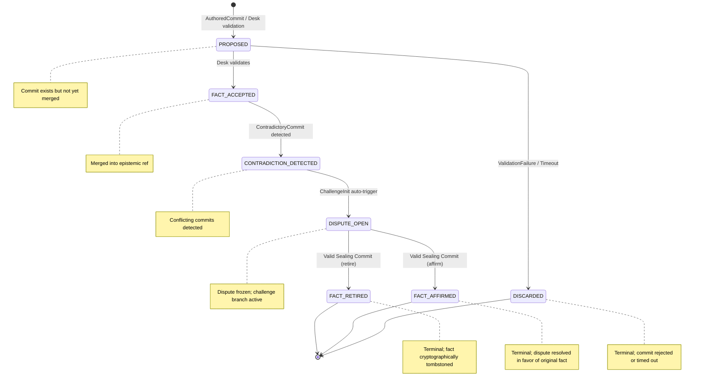

# Epistemic Machine Protocol (EMP)

> A Sovereign, Verifiable Substrate for Distributed Cognitive Integrity

The **Epistemic Machine Protocol (EMP)** is a *cryptographically verifiable, partition-tolerant substrate* for managing **cognitive state** in decentralised, multi-stakeholder systems.

EMP is designed to survive disagreement without erasing it — and resolve conflict without centralising power. It specifies a verifiable, partition-tolerant, cryptographically enforceable
state-transition substrate for decentralised cognitive systems. 

---

## 1. Introduction

> *Truth is not discovered by machines. It is witnessed, negotiated, and held by communities. EMP provides infrastructure for that work — no more, no less.*

EMP draws from but diverges from:
- Distributed state machines (adds epistemic semantics)
- Byzantine quorum systems (adds social roles)
- CRDTs (retains conflict)
= Blockchains (rejects global consensus)

> **Design Ethos**: **Truth** may *pause*. **Contradiction** may *spread*. **Finality** cannot be *forged*.

EMP enforces epistemic safety by forbidding progress without notarised
authority, and ensures liveness by allowing contradiction and challenge
to propagate even when truth cannot yet be finalized.

It solves the **Cognitive Split-Brain Problem** — where autonomous agents (human or machine) hold conflicting beliefs without resolution — by replacing discretion with a **notarised transition algebra**.

EMP is designed for distributed multi-agent systems where:
- **States** represent factual / disputed / finalized epistemic conditions
- **Transitions** are tightly controlled by roles, guards, and cryptographic proofs
- **Agents** have formalised roles and rights
- **Desks** enforce procedural authority without centralising power
- **Conflict** is preserved as first-class, not erased
- **Gossip & partition semantics** guarantee deterministic convergence




EMP is designed for adoption by:
- Indigenous knowledge collectives  
- Public research infrastructures  
- Decentralised cooperatives  
- Intergovernmental scientific bodies  
- Community archives  

It assumes **no universal truth**, **no global authority**, and **no technical monoculture**.

- **Epistemic refs** as authoritative histories
- **First-Class Human Agents** as committers of facts
- **Meta-Agents** for teleological / policy operations
- **Desk (SQL-RBAC)** as deterministic notary
- **Sealing Commits** as cryptographic finality

EMP is closer to a constitutional substrate than a ledger.

---

## 2. Why is EMP?

> **The Problem:** *The Cognitive Split‑Brain?*

### 2.1 Why alternatives fail under epistemic load?

Modern distributed systems increasingly host **cognitive actors**:

* Humans
* LLMs and agentic AI
* Sensors and simulations
* Institutions and committees

These actors generate *claims*, not just data.

#### 2.1.1 The Split‑Brain Failure Mode

A **Cognitive Split‑Brain** occurs when:

* Multiple agents hold mutually incompatible beliefs
* Each belief has plausible provenance
* No shared mechanism exists to *resolve* the conflict

Traditional systems respond by:

* Hiding disagreement (last‑write‑wins)
* Centralising authority (single truth service)
* Externalising resolution (manual governance outside the system)

All three approaches fail under scale, pluralism, or political contestation.

EMP treats disagreement as a **first‑class state**, not an exception.

---

#### 2.1.2 Why EMP Is *Not* a Truth Machine

EMP does not discover truth, optimise beliefs, or rank correctness.

This is a **deliberate refusal**.

#### 2.1.3 Rejected Assumptions

EMP explicitly rejects:

* Universal ontologies
* Objective global truth
* Machine‑final epistemic authority
* Implicit Western scientific primacy

These assumptions collapse in:

* Indigenous knowledge contexts
* Interdisciplinary science
* Politically contested domains
* Long‑horizon archival systems

#### 2.1.4 What EMP Provides Instead

EMP provides:

- **Witnessing** (who asserted what)
- **Process** (how it was challenged)
- **Resolution** (how disagreement ended)
- **Memory** (what was held true at a time)

Truth remains *socially held*.

---

#### 2.2 Why Git‑Like DAGs (and Not CRDTs Alone)

#### 2.2.1 Why Not CRDT‑Only?

CRDTs guarantee convergence by **discarding semantic conflict**.

This is acceptable for:

* Counters
* Presence lists
* Replicated UI state

It is unacceptable for:

* Scientific claims
* Legal facts
* Cultural knowledge
* Historical records

Semantic conflict must be *preserved*, not merged away.

#### 2.2.2 Why a Commit DAG Works

A Git‑like DAG provides:

* Explicit ancestry
* Immutable history
* Branch‑based disagreement
* Cryptographic identity

EMP layers **normative state semantics** on top of the DAG via the EFSM.

The DAG records *what happened*; the EFSM governs *what is allowed*.

---

### 2.3 Why an EFSM (Not Ad‑Hoc Governance)

#### 2.3.1 Governance Drift as a Failure Mode

Systems without formal state machines tend to:

* Accrete exceptions
* Encode policy in comments
* Resolve disputes socially but invisibly

This leads to:

* Non‑reproducible decisions
* Authority smuggling
* Historical ambiguity

#### 2.3.2 EFSM as Epistemic Law

The EMP EFSM:

* Enumerates all valid states
* Enumerates all valid transitions
* Makes invalid moves *unrepresentable*

If a transition is not in the EFSM, it **cannot occur**.

This converts governance from discretion into **verifiable procedure**.

---

### 2.4 Why Desks Are Local and Deterministic

#### 2.4.1 Rejection of Global Authorities

Global notaries fail because they:

* Become political choke points
* Accumulate legitimacy debt
* Are captured or distrusted

EMP therefore mandates **polycentric Desks**.

#### 2.4.2 Why Determinism Matters

A Desk must be:

* Auditable
* Replayable
* Replaceable

Determinism ensures that:

* Two Desks with the same inputs reach the same decision
* Governance disputes can be re‑evaluated
* Power does not hide in implementation variance

The Desk is *procedural*, not sovereign.

---

### 2.5 Why Sealing Commits Provide Finality

#### 2.5.1 The Problem of Endless Dispute

Without finality, systems suffer from:

* Zombie conflicts
* Permanent forks
* Decision paralysis

#### 2.5.2 Cryptographic Finality vs Social Finality

EMP distinguishes:

* **Social legitimacy** (ongoing debate)
* **System finality** (state closure)

Sealing commits provide *system* finality while preserving the full audit trail.

Nothing is erased; disagreement is **closed**, not forgotten.

---

### 2.6 Why Prompts Are Explicitly De‑Powered

#### 2.6.1 Prompt Authority Is a Hidden Risk

LLMs blur the line between:

* Reasoning
* Recommendation
* Assertion

Unconstrained prompts become **shadow governors**.

#### 2.6.2 Prompt Design Principles

EMP enforces that prompts:

* Bind only by hash
* Never issue authority
* Always output drafts
* Require human ratification

Prompts configure *thinking*, not *truth*.

---

### 2.7 Why Sovereignty Is a Technical Constraint

Sovereignty is not political branding in EMP.

It is enforced by:

* Local Desks
* Replaceable components
* Offline‑first operation
* Paper‑compatible workflows

If a community cannot run EMP without cloud access, EMP has failed.

---

### 2.8 Failure Modes EMP Explicitly Addresses

| Failure Mode            | EMP Response            |
| ----------------------- | ----------------------- |
| Hidden disagreement     | Explicit dispute states |
| Authority smuggling     | Role isolation + EFSM   |
| Partition inconsistency | Epistemic freeze        |
| Historical revision     | Immutable seals         |
| AI overreach            | Prompt de‑authorization |

---

### 2.9 What EMP Intentionally Does *Not* Solve

EMP does **not**:

* Decide which belief is correct
* Enforce ethical norms
* Rank epistemic traditions
* Replace human governance

It provides **infrastructure**, not judgment.

---

### 2.10 Relationship to Adjacent Work

EMP draws from but diverges from:

* Distributed state machines (adds epistemic semantics)
* Byzantine quorum systems (adds social roles)
* CRDTs (retains conflict)
* Blockchains (rejects global consensus)


---

## 3. Architecture Overview

### 3.1 Abstractions & Models

| Term | Definition | Technical Realisation |
|------|------------|----------------------|
| **Fact** | A belief asserted by a human, recorded as a Git commit object | `Commit` (CUE schema) with `author ∈ First-Class Human Agent` |
| **Ref** | A mutable pointer to a commit history, categorised by `trust_level` | e.g., `refs/epistemic/@community/climate/main` |
| **Desk** | A locally governed notary service for validation and sealing | SQL-RBAC backend (PostgreSQL-compatible) |
| **Seal** | A cryptographic commitment that resolves a dispute | `SealingCommit` with `Quorum-Signatures` |
| **Epistemic Ref** | Authoritative history of what a community holds true | Append-only DAG, frozen on contradiction |


### 3.2 Layered Architecture (Polycentric)

EMP separates concerns into four interoperable layers — each locally governed, each stack-agnostic.

```
┌───────────────────────────────────────────────────────┐
│ Executive Layer: Enacts decisions (e.g., policy roll-out)
└───────────────────────────────────────────────────────┘
                    ▲
                    │ signed action
┌───────────────────────────────────────────────────────┐
│ Teleological Layer: Defines norms & objectives
│ (e.g., "Reduce emissions by 2030")
│ → refs/teleological/@community/policy/v3
└───────────────────────────────────────────────────────┘
                    ▲
                    │ hash-pinned proposals
┌───────────────────────────────────────────────────────┐
│ Deliberative Layer: Configures reasoning
│ (e.g., prompts, tools, cross-knowledge comparison)
│ → PromptSpec (YAML/CUE), hash-only binding
└───────────────────────────────────────────────────────┘
                    ▲
                    │ ratified proposals
┌───────────────────────────────────────────────────────┐
│ Epistemic Layer: Records what is held true
│ (e.g., "CO₂ > 420ppm in 2025 — NOAA, sealed")
│ → refs/epistemic/@community/climate/verified
└───────────────────────────────────────────────────────┘
```

> **Interoperability**: Layers communicate via **signed, hash-pinned messages** — no shared database required.

### 3.3 Agent Taxonomy (Community-Defined Roles)

Agents are **social roles**, mapped to technical capabilities. Roles are *contextual*, *consensual*, and *non-hierarchical*.

> **Sovereignty Note**: A *Knowledge Keeper* in one community may be an *Observer* in another. Roles are defined by **local consensus**, not global registry.

| Role | Epistemic Authority | Commit Capability | Identity Basis | Normative Constraint |
|------|---------------------|-------------------|----------------|----------------------|
| **Knowledge Keeper** | Authoritative | Committer | Human | **Only** role permitted to `AUTHOR` epistemic facts. |
| **Notary (Desk)** | Advisory | Committer | Human collective / institution | **MUST NOT** appear in `author` field. **MAY** issue `SealingCommits`. |
| **Interpreter** | Advisory | Proposer | Human / AI / Tool | **MAY** propose teleological updates or cross-regime summaries. |
| **Observer** | — | Observer | Any | **MAY** audit, monitor, alert. **MUST NOT** emit commits. |
| **Sensor/Probe** | Synthetic | Proposer | Device / Simulation | **MAY** propose with `trustLevel: draft`. **MUST** include calibration metadata. |

---

## 4. Gossip Protocol & Partition Semantics

### 4.1 Message Structure (ABNF)

```abnf
gossip-packet       = signed-envelope
signed-envelope     = payload ref-hint connectivity-status dispute-vector signature
payload             = git-commit / git-bundle
ref-hint            = "epistemic" / "teleological"
connectivity-status = "online" / "offline" / advisory
dispute-vector      = 1*(commit-hash)
signature           = base64
```

### 4.2 Invariants

* **G-INV-0 (Monotonicity):**
  Nodes must not delete or hide received commits or dispute vectors
* **G-INV-1 (Epistemic Freeze):**
  Nodes must not advance epistemic refs without an active Desk session
* **G-INV-2 (Challenge Fluidity):**
  Challenge branches propagate regardless of connectivity
* **G-INV-3 (Conflict Propagation):**
  Contradictions freeze refs and propagate challenge immediately

### 4.3 Partition Recovery Protocol

1. Accept gossip only; accumulate `PROPOSED` commits in quarantine
2. Track `CONTRADICTION_DETECTED` locally
3. Do not advance epistemic refs during partition
4. On reconnection:

   * Authenticate node → Desk
   * Exchange partition marker: `HEAD`, challenges, nonce
   * Desk responds with authoritative `HEAD`, sealing commits, signed nonce
   * Node applies deterministic revalidation loop
   * Retry up to `T_retry_max` if Desk unreachable

---

## 5. State Machine: Epistemic EFSM (Normative)

All epistemic commits follow a deterministic, verifiable transition algebra.

### 5.1. EFSM Definition

```text
States S = {
  PROPOSED,
  FACT_ACCEPTED,
  CONTRADICTION_DETECTED,
  DISPUTE_OPEN,
  FACT_RETIRED,
  FACT_AFFIRMED,
  DISCARDED
}

Inputs I = {
  AuthoredCommit,
  ValidationFailure,
  ContradictoryCommit,
  ChallengeInit,
  ValidSealingCommit
}

Final States F = {
  FACT_RETIRED, FACT_AFFIRMED, DISCARDED
}
```

Initial state: `PROPOSED`  
EFSM = `(S, I, T, PROPOSED, F)`

### 5.2. Transition Table (Enforced by Desk)

| From | Input | To | Guard Condition |
|------|-------|----|-----------------|
| `PROPOSED` | `AuthoredCommit` | `FACT_ACCEPTED` | `Desk validation active ∧ principal ∈ Knowledge Keeper` |
| `PROPOSED` | `ValidationFailure / Timeout` | `DISCARDED` | `timer > T_max` (e.g., 10s) |
| `FACT_ACCEPTED` | `ContradictoryCommit` | `CONTRADICTION_DETECTED` | Semantic conflict detected (schema-aware) |
| `CONTRADICTION_DETECTED` | `ChallengeInit` | `DISPUTE_OPEN` | Auto-triggered; ref frozen |
| `DISPUTE_OPEN` | `ValidSealingCommit(retire)` | `FACT_RETIRED` | Quorum ≥ ⌈N/2⌉+1, ≥1 `FINALITY` signer |
| `DISPUTE_OPEN` | `ValidSealingCommit(affirm)` | `FACT_AFFIRMED` | Same as above |

### 5.3. Formal Invariants

```text
∀ c ∈ Commits: c.state ∈ S  
∀ c: c.state ∈ F ⇒ is_terminal(c)  
∀ c₁, c₂: CONTRADICTION_DETECTED(c₁, c₂) ⇒ ∃ DISPUTE_OPEN(c₁ ∨ c₂)  
Any transition not in T MUST be rejected
```

### 5.4 Desk / SQL-RBAC Interface

#### 5.4.1 Guard Evaluation

Transition `(P, R, C)` is valid if:

1. Principal `P` has rights for ref `R`
2. Commit `C` is consistent with DAG
3. Desk connection is active

**Determinism**

* Desk returns signed `ACCEPT` or `REJECT`
* Responses are idempotent
* Reject if `R` is in `DISPUTE_OPEN`

---

## 6. Network Layer: Gossip & Partition Recovery

### 6.1. Gossip Message (ABNF)

```abnf
gossip-packet       = signed-envelope
signed-envelope     = payload ref-hint connectivity-status dispute-vector signature
payload             = git-commit / git-bundle
ref-hint            = "epistemic" / "teleological"
connectivity-status = "online" / "offline" / "degraded"
dispute-vector      = 1*(commit-hash)
signature           = base64
```

### 6.2. Network Invariants

| Invariant | Meaning |
|----------|---------|
| **G-INV-0 (Monotonicity)** | Nodes must not delete or hide received commits or dispute vectors |
| **G-INV-1 (Epistemic Freeze)** | Nodes must not advance epistemic refs without an active Desk session |
| **G-INV-2 (Challenge Fluidity)** | Challenge branches propagate regardless of connectivity |
| **G-INV-3 (Conflict Propagation)** | Contradictions freeze refs and propagate challenge immediately |

### 6.3. Partition Recovery Protocol

1. During partition:  
   - Accept gossip only  
   - Accumulate `PROPOSED` in quarantine  
   - Track `CONTRADICTION_DETECTED` locally  
   - **Do not advance epistemic refs**  

2. On reconnection:  
   - Authenticate → Desk  
   - Exchange: `HEAD`, challenges, nonce  
   - Desk responds with: authoritative `HEAD`, sealing commits, signed nonce  
   - Node applies deterministic revalidation  
   - Retry up to `T_retry_max` (e.g., 5 min) if Desk unreachable  

---

## 7. Formal Semantics & Machine Readability

### 7.1 ABNF Grammar (Sealing Commit)

```abnf
sealing-commit     = git-commit-header sealing-trailers sealing-content
git-commit-header =
  "tree " HEXDIG{40} CRLF
  "parent " HEXDIG{40} CRLF
  "author " author-ident CRLF
  "committer " committer-ident CRLF CRLF

sealing-content =
  *(UTF8-NONASCII / %x20-7E)
```

### 7.2 EMP Implementation Contract

```python
class EmpImplementation:
    def get_commit_state(self, commit_hash: str) -> str: ...
    def apply_transition(
        self,
        commit_hash: str,
        target_state: str,
        reason: str | None = None,
        seal: GitCommit | None = None
    ) -> bool: ...
    def get_seal_for(self, commit_hash: str) -> GitCommit | None: ...
    def detect_contradiction(self, commit1: str, commit2: str) -> bool: ...
    def verify_sealing_commit(self, seal: GitCommit) -> VerificationResult: ...
```

## 7.3 Desk: SQL-RBAC Notary Service

The Desk is a **locally operated**, **auditable**, **deterministic** notary — not a global authority.

### 7.1 Guard Evaluation

A transition `(P, R, C)` is valid iff:
1. Principal `P` has rights for ref `R` (via RBAC policy)
2. Commit `C` is consistent with DAG
3. Desk connection is active
4. `R` is not in `DISPUTE_OPEN`

> ✅ **Determinism**: Desk returns signed `ACCEPT`/`REJECT`; responses are idempotent.

### 7.2 SQL Schema (PostgreSQL-Compatible)

> **Implementation Note**: Desk logic is encapsulated in `desk_authorize()` (PL/pgSQL) — portable to SQLite, DuckDB, or paper ledger.

```sql
-- Principals (humans, desks, observers)
CREATE TABLE principals (
  id       UUID PRIMARY KEY,
  name     TEXT NOT NULL,
  key_id   TEXT NOT NULL,  -- e.g., "ED25519:abc123"
  agent_role TEXT NOT NULL, -- e.g., "Knowledge Keeper"
  source_type TEXT CHECK (source_type IN ('human','ai','sensor')),
  created_at TIMESTAMPTZ
);

-- RBAC Policy Rules (CUE-validated YAML → SQL)
CREATE TABLE policy_rules (
  id                UUID PRIMARY KEY,
  ref_glob          TEXT NOT NULL,  -- e.g., 'refs/epistemic/@community/*'
  verb              TEXT NOT NULL,  -- propose, seal, retire
  required_roles    TEXT[],
  min_trust_level   TEXT,
  requires_human    BOOLEAN DEFAULT true
);

-- Audit Log
CREATE TABLE rbac_transactions (
  id            UUID PRIMARY KEY,
  principal_id  UUID REFERENCES principals(id),
  action        TEXT,
  target        JSONB,
  decision      TEXT CHECK (decision IN ('ALLOW','DENY')),
  timestamp     TIMESTAMPTZ DEFAULT NOW()
);
```

---

## 8. Prompt Design: Instrument, Not Authority

Prompts are **deliberative instruments** — they configure reasoning, but never assert truth.

### 8.1 Prompt Specification Language (PSL)

A YAML/CUE DSL for hash-pinned, non-authoritative deliberation.

```yaml
apiVersion: emp.ps/v1
kind: PromptSpec
meta:
  agent: { principalID: "interp-01", role: "Interpreter" }
  ref: refs/teleological/@community/summary/v3
spec:
  template: "Compare climate accounts from multiple traditions."
  inputs:
    - type: epistemic
      hash: "sha3-512:a1b2..."   # IPCC AR7 — pinned
      tradition: western-scientific
    - type: epistemic
      hash: "sha3-512:c3d4..."   # Mātauranga — pinned
      tradition: indigenous-aotearoa
  output:
    targetRef: refs/epistemic/@community/drafts/climate-comparison
    reviewerRoles: ["knowledge-keeper"]
```

### 8.2 Normative Constraints

- **Hash-Only Binding (HOB)**: References **only by hash**, never mutable ref/URI  
- **No Authority Assertion**: Prompts **MUST NOT** contain “seal”, “retire”, “you are the Desk”  
- **Output Gating**: LLM outputs → `Synthetic Proposer` → `trustLevel: draft` → FCHA ratification  

---

## 9. Security & Crytographic Finality

### 9.1 Sealing Commits: Steel Roof (ABNF).

Sealing commits resolve disputes with cryptographic finality.

#### 9.1.1 Definition

* Moves `DISPUTE_OPEN` → `FACT_RETIRED` or `FACT_AFFIRMED`
* Must be a direct child of the disputed commit

#### 9.1.2 Manifest (ABNF)

```abnf
sealing-trailers =
  "Epistemic-Seal-Version:" version CRLF
  "Seals-Target-Commit:" commit-hash CRLF
  "Resolution-Type:" ("RETIRE" / "REAFFIRM" / "AMEND") CRLF
  "RBAC-Transaction-ID:" uuid CRLF
  "Quorum-Signatures:" json-array CRLF
```

```abnf
sealing-commit     = git-commit-header sealing-trailers sealing-content
git-commit-header  = "tree " HEXDIG{40} CRLF
                     "parent " HEXDIG{40} CRLF
                     "author " author-ident CRLF
                     "committer " committer-ident CRLF CRLF
sealing-trailers   = "Epistemic-Seal-Version:" version CRLF
                     "Seals-Target-Commit:" commit-hash CRLF
                     "Resolution-Type:" ("RETIRE" / "REAFFIRM" / "AMEND") CRLF
                     "RBAC-Transaction-ID:" uuid CRLF
                     "Quorum-Signatures:" json-array CRLF
```

### 9.2 Quorum Semantics

- Threshold: `⌈N/2⌉ + 1`  
- ≥1 signer with `FINALITY` permission  
- Signers must be active at transaction timestamp  
- Reject duplicate signatures

### 9.3 Verification

- Canonical serialization (exclude quorum signatures)  
- SHA-512 hash verification  
- Seal valid iff threshold + authority rules satisfied  
- Application is idempotent  

> **Sample Seal**: See [Appendix B: Sealing Commit Example](#appendix-b-sealing-commit-example)

### 9.4 Security Considerations

> **Steel Roof Invariants**: Prevent connectivity spoofing, zombie disputes, and semantic forks.

* Byzantine humans mitigated via N-of-M quorum
* Partition recovery ensures deterministic reconciliation
* Steel Roof invariants prevent connectivity spoofing, zombie disputes, and semantic forks
* Historical seals remain auditable under RBAC changes

| Threat | Mitigation |
|--------|------------|
| Byzantine actors | N-of-M quorum sealing |
| Partition attacks | Deterministic recovery (G-INV-1, G-INV-3) |
| Prompt injection | HOB + Desk pre-validation |
| Context drift | Hash-pinned references |
| Authority smuggling | Role isolation + CUE guards |
| Historical revision | Immutable seals + audit log |
| Semantic forks | Steel Roof invariants |

---

## 10. Implementation Contract (Language-Agnostic)

All EMP implementations **MUST** support:

```python
class EmpImplementation:
    def get_commit_state(self, commit_hash: str) -> str: ...
    def apply_transition(
        self,
        commit_hash: str,
        target_state: str,
        reason: str | None = None,
        seal: GitCommit | None = None
    ) -> bool: ...
    def get_seal_for(self, commit_hash: str) -> GitCommit | None: ...
    def detect_contradiction(self, commit1: str, commit2: str) -> bool: ...
    def verify_sealing_commit(self, seal: GitCommit) -> VerificationResult: ...
```

> **Reference Implementation**:  
> - CUE schemas (`schemas/`)  
> - SQL DDL (`desk/ddl.sql`)  
> - Offline-first CLI (`emp commit --offline`)  
> - Paper backup tool (`emp paper export`)  

---

## 11. Sovereign Deployment Pathways

| Context | Recommended Stack |
|---------|-------------------|
| **Rural Community** | SQLite Desk + signed JSON files + USB sync |
| **Indigenous Archive** | Paper + QR-coded hashes + council as Desk |
| **National Research Grid** | PostgreSQL Desk + IPFS storage + federated identity |
| **Global South University** | Offline-first P2P (e.g., Scuttlebutt) + local Desk |

All interoperate via:
- Standardised commit format (JSON-LD)  
- BLAKE3 hash serialization  
- Ed25519 signatures  

---

## 12. References & Appendix

* Git object model and commit DAG
* CRDTs and eventual consistency
* Byzantine quorum systems
* Distributed state machine theory

### 12.1 Pseudocode for Transition Verification

```python
def apply_transition(commit_hash: str, target_state: str, seal: Optional[GitCommit] = None) -> bool:
    """
    Verify and apply a transition in EMP EFSM.
    """
    current_state = get_commit_state(commit_hash)

    # Check if transition is valid
    if (current_state, target_state) not in allowed_transitions():
        return False  # EFSM-1 invariant: reject invalid transitions

    # Desk validation if required
    if requires_desk_validation(target_state):
        if not desk_connection_active():
            return False
        if not desk_validate_transition(commit_hash, target_state):
            return False

    # Verify sealing commit if present
    if seal is not None:
        result = verify_sealing_commit(seal)
        if not result.valid:
            return False

    # Apply transition
    set_commit_state(commit_hash, target_state)
    return True
```

---

### 12.2 Sample Gossip Message (JSON)

```json
{
  "payload": {
    "commit_hash": "abcd1234...",
    "author": "Alice",
    "message": "Add new epistemic fact"
  },
  "ref_hint": "epistemic",
  "connectivity_status": "online",
  "dispute_vector": [],
  "signature": "BASE64_SIGNATURE_HERE"
}
```

---

### 12.3 Sample Sealing Commit (Git commit message)

```text
tree e3f1a2...
parent ab12cd...
author Desk <desk@example.com>
committer Desk <desk@example.com>

Epistemic-Seal-Version: v1
Seals-Target-Commit: abcd1234...
Resolution-Type: RETIRE
RBAC-Transaction-ID: 123e4567-e89b-12d3-a456-426614174000
Quorum-Signatures: [
    {
        "algorithm": "ed25519",
        "principal": "Alice",
        "signature": "BASE64_SIG",
        "timestamp": "2025-12-16T21:30:00Z",
        "nonce": "550e8400-e29b-41d4-a716-446655440000"
    },
    {
        "algorithm": "ed25519",
        "principal": "Bob",
        "signature": "BASE64_SIG",
        "timestamp": "2025-12-16T21:30:05Z",
        "nonce": "550e8400-e29b-41d4-a716-446655440001"
    }
]
```

---

### 12.4 Temporal Bounds Definitions

| Parameter      | Description                                                                            | Example Value |
| -------------- | -------------------------------------------------------------------------------------- | ------------- |
| `T_max`        | Maximum time to validate a proposed commit                                             | 10s           |
| `T_revalidate` | Maximum time to wait for Desk during partition recovery before pausing ref advancement | 30s           |
| `T_retry_max`  | Maximum total retry time for partition reconciliation                                  | 5 min         |

---


### 12.A Appendix A — Formal Math 

This appendix restates EMP formal semantics using **ASCII math** and
**code-block notation** compatible with GitHub-flavored Markdown (GFM).
No LaTeX or MathJax is required.

---

#### A.1 Sets and Domains

```text
Commit        := immutable git commit object
CommitHash   := 40-hex SHA-1 (or SHA-256 future)
State        := symbolic label
Input        := event or observation
Guard        := boolean predicate
Principal    := authenticated identity
Ref          := mutable named pointer
````

```text
S (States) =
  { PROPOSED,
    FACT_ACCEPTED,
    CONTRADICTION_DETECTED,
    DISPUTE_OPEN,
    FACT_RETIRED,
    FACT_AFFIRMED,
    DISCARDED }

I (Inputs) =
  { AuthoredCommit,
    ValidationFailure,
    ContradictoryCommit,
    ChallengeInit,
    ValidSealingCommit }

F (Final States) =
  { FACT_RETIRED,
    FACT_AFFIRMED,
    DISCARDED }
```

---

#### A.2 EFSM Definition

```text
T ⊆ S × I × S × G
```

Where:

```text
(s, i, s', g) ∈ T
means:
  if current_state == s
  and input == i
  and guard g evaluates to true
  then transition to s'
```

Initial state:

```text
s0 = PROPOSED
```

EFSM tuple:

```text
EFSM = (S, I, T, s0, F)
```

---

#### A.3 Transition Function (Deterministic Form)

```text
δ : (State, Input, Context) → State | REJECT
```

Rules:

```text
δ(s, i, ctx) = s'
  if ∃ g such that (s, i, s', g) ∈ T and g(ctx) == true

δ(s, i, ctx) = REJECT
  otherwise
```

---

#### A.4 Commit State Invariants

##### A.4.1 State Validity

```text
∀ c ∈ Commits :
  state(c) ∈ S
```

##### A.4.2 Terminal Immutability

```text
∀ c ∈ Commits :
  state(c) ∈ F
    ⇒
  no further transitions allowed
```

Equivalent rule:

```text
state(c) ∈ F  ⇒  outgoing_transitions(c) = ∅
```

---

#### A.5 Contradiction & Dispute Invariants

##### A.5.1 Mandatory Dispute Creation

```text
∀ c1, c2 ∈ Commits :
  contradiction(c1, c2)
    ⇒
  ( state(c1) = DISPUTE_OPEN
    or
    state(c2) = DISPUTE_OPEN )
```

##### A.5.2 No Silent Contradictions

```text
contradiction(c1, c2)
  ⇒
challenge_branch_exists(c1 or c2)
```

---

#### A.6 Ref Advancement Safety

##### A.6.1 Desk Authority

```text
advance(ref, commit)
  ⇒
active_desk_session(ref)
```

##### A.6.2 Dispute Freeze

```text
ref_contains(commit)
and state(commit) = DISPUTE_OPEN
  ⇒
ref_is_frozen(ref)
```

---

#### A.7 Sealing Commit Semantics

##### A.7.1 Sealing Preconditions

```text
seal(c_target) is valid iff:

1. state(c_target) = DISPUTE_OPEN
2. seal.parent = c_target
3. quorum_signatures ≥ ceil(N/2) + 1
4. ∃ signer with FINALITY permission
5. all signatures valid at timestamp t
```

##### A.7.2 Sealing Transition

```text
apply_seal(c_target, seal):

  if seal.resolution = RETIRE:
      state(c_target) := FACT_RETIRED

  if seal.resolution = REAFFIRM:
      state(c_target) := FACT_AFFIRMED
```

---

#### A.8 Idempotence Rules

```text
apply(seal, system_state)
  =
apply(seal, apply(seal, system_state))
```

```text
apply(reject, system_state)
  =
system_state
```

---

#### A.9 Partition Tolerance Properties

##### A.9.1 Monotonic Knowledge

```text
received_commits(t1) ⊆ received_commits(t2)
  for all t2 ≥ t1
```

##### A.9.2 Eventual Convergence

```text
if all nodes reconnect to Desk
and Desk reachable
  ⇒
all epistemic refs converge to Desk HEAD
```

---

#### A.10 Safety vs Liveness Summary

```text
Safety:
  - No invalid state transitions
  - No silent contradictions
  - No unauthorized ref advancement

Liveness:
  - Challenges propagate under partition
  - Disputes eventually seal when quorum reachable
```

---

## 12.B Appendix B — Inference Rules

This appendix expresses EMP semantics using **inference rules** in a proof-theoretic style.

Judgements have the form:

```text
Γ |- judgment
```

Where:

* `Γ` (Gamma) is the system context
* `|-` means “entails” or “may derive”
* `judgment` is a state, transition, or property

---

### B.1 Context Definitions

```text
Γ =
  { Commits,
    States,
    Transitions,
    Desk,
    RBAC,
    Refs,
    Time }
```

Auxiliary predicates:

```text
state(c)              : Commit → State
guard(g, Γ)           : Guard → Bool
contradiction(c1,c2)  : Commit × Commit → Bool
has_rights(p, r)      : Principal × Ref → Bool
active_desk(r)        : Ref → Bool
terminal(s)           : State → Bool
```

---

### B.2 State Introduction Rules

#### B.2.1 Commit Proposal

```text
[PROPOSE]
────────────────────────────
Γ |- state(c) = PROPOSED
```

A newly authored commit always begins in `PROPOSED`.

---

### B.3 Validation Rules

#### B.3.1 Desk Acceptance

```text
[ACCEPT]
state(c) = PROPOSED
has_rights(p, r)
active_desk(r)
────────────────────────────
Γ |- state(c) = FACT_ACCEPTED
```

#### B.3.2 Desk Rejection

```text
[REJECT]
state(c) = PROPOSED
¬has_rights(p, r) ∨ ¬active_desk(r)
────────────────────────────
Γ |- state(c) = DISCARDED
```

---

### B.4 Contradiction Detection Rules

#### B.4.1 Contradiction Emergence

```text
[CONTRADICTION]
state(c1) = FACT_ACCEPTED
state(c2) = FACT_ACCEPTED
contradiction(c1, c2)
────────────────────────────
Γ |- state(c1) = CONTRADICTION_DETECTED
```

(Note: symmetric for `c2`.)

---

### B.5 Dispute Rules

#### B.5.1 Mandatory Dispute Opening

```text
[OPEN-DISPUTE]
state(c) = CONTRADICTION_DETECTED
────────────────────────────
Γ |- state(c) = DISPUTE_OPEN
```

This rule is **non-optional** and auto-triggered.

---

### B.6 Dispute Freeze Rules

#### B.6.1 Ref Freeze

```text
[FREEZE]
state(c) = DISPUTE_OPEN
ref_contains(r, c)
────────────────────────────
Γ |- frozen(r)
```

#### B.6.2 Frozen Ref Non-Advancement

```text
[NO-ADVANCE]
frozen(r)
────────────────────────────
Γ |- ¬advance(r)
```

---

### B.7 Sealing Rules (Finality)

#### B.7.1 Seal Validity

```text
[SEAL-VALID]
state(c) = DISPUTE_OPEN
parent(seal) = c
quorum(seal) ≥ ceil(N/2) + 1
finality_signer(seal)
────────────────────────────
Γ |- valid_seal(seal, c)
```

---

#### B.7.2 Seal → Retire

```text
[SEAL-RETIRE]
valid_seal(seal, c)
seal.resolution = RETIRE
────────────────────────────
Γ |- state(c) = FACT_RETIRED
```

#### B.7.3 Seal → Reaffirm

```text
[SEAL-AFFIRM]
valid_seal(seal, c)
seal.resolution = REAFFIRM
────────────────────────────
Γ |- state(c) = FACT_AFFIRMED
```


#### B.7.4 Sealing Commit Example

```text
tree e3f1a2b3c4d5e6f7a8b9c0d1e2f3a4b5c6d7e8f9
parent ab12cd34ef56...

author Desk <desk@community.org>
committer Desk <desk@community.org>

Epistemic-Seal-Version: v1
Seals-Target-Commit: abcd1234...
Resolution-Type: RETIRE
RBAC-Transaction-ID: 123e4567-e89b-12d3-a456-426614174000
Quorum-Signatures: [
    {
        "algorithm": "ed25519",
        "principal": "Elder_A",
        "signature": "MEUCIQD...",
        "timestamp": "2025-12-16T21:30:00Z",
        "nonce": "550e8400-e29b-41d4-a716-446655440000"
    },
    {
        "algorithm": "ed25519",
        "principal": "Scientist_B",
        "signature": "MEYCIQD...",
        "timestamp": "2025-12-16T21:30:05Z",
        "nonce": "550e8400-e29b-41d4-a716-446655440001"
    }
]
```

---

### B.8 Terminal State Rules

#### B.8.1 Terminal Definition

```text
[TERMINAL]
state(c) ∈ { FACT_RETIRED, FACT_AFFIRMED, DISCARDED }
────────────────────────────
Γ |- terminal(state(c))
```

#### B.8.2 No Escape from Terminal States

```text
[NO-EXIT]
terminal(state(c))
────────────────────────────
Γ |- ¬∃ s' . transition(c, s')
```

---

### B.9 Determinism Rules

#### B.9.1 Single Valid Transition

```text
[DETERMINISM]
Γ |- (c, i) ⇒ s1
Γ |- (c, i) ⇒ s2
────────────────────────────
Γ |- s1 = s2
```

No input produces two different valid states.

---

### B.10 Idempotence Rules

#### B.10.1 Seal Idempotence

```text
[IDEMP-SEAL]
apply(seal, Γ) = Γ'
────────────────────────────
apply(seal, Γ') = Γ'
```

#### B.10.2 Reject Idempotence

```text
[IDEMP-REJECT]
apply(reject, Γ)
────────────────────────────
Γ unchanged
```

---

### B.11 Safety Theorems (Informal)

```text
THEOREM (No Silent Forks):
  Contradiction implies dispute.

THEOREM (No Unauthorized Truth):
  FACT_* states require Desk and quorum.

THEOREM (Finality):
  Once sealed, truth cannot transition further.
```

---

### B.12 Reading Guide

* Rules read **top → bottom**
* Premises must all hold
* Line separates premises from conclusion
* Named rules define enforceable invariants, not suggestions

> EMP is not probabilistic.
> If a rule fires, it *must* fire.
> If it cannot fire, the system halts progress.

---

### Appendix C: Temporal Bounds

| Parameter | Description | Example |
|----------|-------------|---------|
| `T_max` | Max validation time for `PROPOSED` | 10s |
| `T_revalidate` | Max wait for Desk during partition | 30s |
| `T_retry_max` | Max retry time for reconciliation | 5 min |
| `T_review_max` | Max review time for AI drafts | 24h |

---
